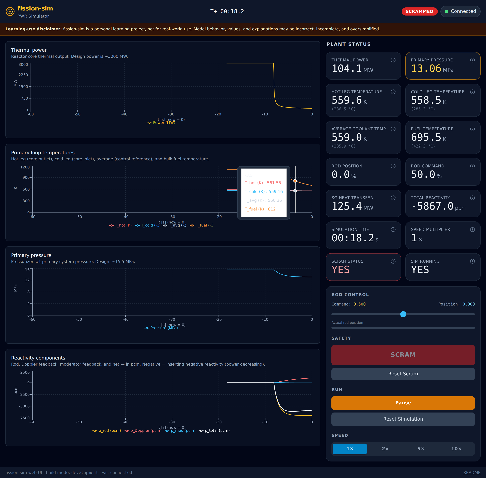

# fission-sim

> This project is **not** for any real-world use and was built as a side-project for personal learning. Information was collected from public sources on search engines, Wikipedia, etc. The author does not have any training or experience in this space so components are likely incorrect, incomplete, and over simplifications.

fission-sim is a pressurized-water-reactor learning simulator which allows you to interact with the reactor by inserting and removing control rods. Changes to
the reactor state then affect reactivity, temperature, and pressure within the system. This is a hobby learning project to work with complex multi-stage systems
and likely contains bugs and mistakes.

Both a CLI and React UI are available to interact with the simulation.



Read `.docs/design.md` for the original goals and architecture. Developer
workflow, Web API details, architecture notes, and code-level conventions live
in [DEVELOPMENT.md](DEVELOPMENT.md).

## Quickstart

### Prerequisites

- Python 3.11+
- Node.js 20+ (or 22+)
- `uv` installed (see [astral.sh/uv](https://astral.sh/uv))

### Install

    make install

This runs `uv sync && npm install --prefix web` — it installs the Python
package (in a `.venv`) and the frontend's Node dependencies in one step.

For Python-only use, run `uv sync`.

### Run The Dashboard

The dashboard streams simulator telemetry at 10 Hz while running and exposes
operator controls for rod command, SCRAM, pause/resume, reset, and simulation
speed. The backend also supports a pressure-setpoint command for scripts and
experiments.

    make dev

Starts both the FastAPI/uvicorn backend (port 8000) and the Vite dev server
(port 5173) concurrently, with colour-prefixed output. Press **Ctrl-C** to
stop both processes.

Open [http://localhost:5173](http://localhost:5173) in a browser once both
processes are ready (the Vite line `VITE vX.Y.Z ready` appears in the
terminal).

> **LAN access** — both servers bind `0.0.0.0`, so the dashboard is reachable
> from any host on your network at `http://<your-machine-ip>:5173` (Vite
> prints the LAN URL on the `Network:` line). There is **no authentication**
> — only expose this on a trusted network.

> **Windows users** — the `make dev` launcher is Unix-only (it relies on
> Python's `os.kill` / `signal` APIs). Run the two processes in separate
> terminals instead:
>
>     uv run python -m fission_sim.api   # backend, port 8000
>     npm run dev --prefix web           # frontend, port 5173

### Run From The CLI

The CLI scripts are useful when you want a quick simulation without a browser,
or when you want to inspect the model's raw outputs.

| Command | What it shows |
|---|---|
| `uv run python examples/console.py` | Interactive terminal dashboard with live commands |
| `uv run python examples/console.py --speed 60` | Same console, 60 simulated seconds per wall second |
| `uv run python examples/report_primary.py` | Text-only primary-plant report, good over SSH |
| `uv run python examples/power_maneuver.py` | Text report for a controlled rod-driven power maneuver |
| `uv run python examples/run_primary.py` | Matplotlib plots for the coupled primary plant |
| `uv run python examples/run_core.py` | Matplotlib plots for point kinetics only |

## How The Model Fits Together

The simulator is not a plant procedure trainer. It is a small dynamic model
built to make the major feedback loops visible.

The shortest mental model is:

1. **Rod command changes reactivity.** Rods absorb neutrons. Inserting them
   adds negative reactivity and tends to reduce power; withdrawing them tends
   to increase power.
2. **The core turns reactivity into heat.** Point kinetics tracks neutron
   population, delayed-neutron precursors, and fuel temperature. Delayed
   neutrons are why reactor power changes on human-observable timescales
   instead of only prompt-neutron timescales.
3. **The primary loop moves heat.** Hot-leg and cold-leg coolant temperatures
   represent the sealed water loop carrying heat from the core to the steam
   generator.
4. **The steam generator removes heat.** In this model it is a simplified heat
   sink. If core heat and steam-generator heat removal do not match, primary
   temperatures move.
5. **The pressurizer holds pressure.** A simplified pressurizer/controller pair
   uses heater and spray behavior to move primary pressure back toward setpoint
   during transients.

### Main Pieces

| Layer | Code | Role |
|---|---|---|
| Dashboard/API | `web/`, `src/fission_sim/api/` | Browser UI, WebSocket telemetry, operator commands |
| Engine | `src/fission_sim/engine/` | Wires components, owns the state vector, advances time |
| Control | `src/fission_sim/control/` | Pressurizer control logic |
| Physics | `src/fission_sim/physics/` | Core, rods, primary loop, steam generator, pressurizer |
| Examples | `examples/` | CLI/report/plot drivers for common scenarios |

Each physics component owns its parameters and equations, but not its evolving
state. State lives in one numpy vector owned by `SimEngine`. Components expose
`initial_state()`, `derivatives(...)`, `outputs(...)`, and `telemetry(...)`.
The engine wires outputs into inputs, then integrates the coupled ODE system
with SciPy's BDF solver.

### What To Watch

| Signal | Why it matters |
|---|---|
| `power_thermal` | Core heat output. After SCRAM it drops sharply, then decays more slowly. |
| `rho_total` | Net reactivity. Near zero means roughly critical; negative means power tends down. |
| `rho_rod`, `rho_doppler`, `rho_moderator` | The three visible reactivity contributions. |
| `T_hot`, `T_cold`, `T_avg`, `T_fuel` | Heat moving from fuel into coolant and around the primary loop. |
| `P_primary_MPa` | Pressurizer-controlled primary-loop pressure. |
| `Q_sg` | Heat removed by the steam generator. Compare with core power. |
| `rod_command` vs. `rod_position` | Requested rod target vs. physical rod lag. |

The component guide below explains each model in more depth.

## Educational Component Guide

Each component section follows the same learning path:

- **What it represents** — the real plant part or modeling idea.
- **Equations used** — the formulas the code evaluates.
- **State and parameters** — what changes over time vs. what stays fixed.
- **API** — how the component is called from examples or the simulation engine.

### PointKineticsCore (`src/fission_sim/physics/core.py`)

L1 point kinetics with six lumped delayed-neutron groups + Doppler +
moderator temperature feedback. See `.docs/design.md` §5.1 for physics.

**What it represents**

The core is where fission heat is produced. At L1 we do not model the shape of
the core or where neutrons are inside it. Instead, the whole core is collapsed
into one "point" with one normalized neutron population `n`. If `n = 1`, the
reactor is at design thermal power; if `n = 0.5`, it is at half power.

The important educational idea is delayed neutrons. Most neutrons appear
immediately after fission, but a small fraction arrive later from radioactive
decay products. Those delayed neutrons stretch reactor response from
microseconds to seconds and make control possible, so the model tracks six
delayed-neutron precursor groups.

**Equations used**

Point kinetics tracks neutron population and precursor buildup/decay:

```text
dn/dt   = ((ρ − β) / Λ) · n + Σᵢ λᵢ · Cᵢ
dCᵢ/dt = (βᵢ / Λ) · n − λᵢ · Cᵢ
```

Reactivity `ρ` is the "how far from exactly critical are we?" number:

```text
ρ = ρ_rod + α_f · (T_fuel − T_fuel_ref) + α_m · (T_cool − T_cool_ref)
```

`ρ_rod` comes from the rods. The two temperature terms are feedbacks. Because
`α_f` and `α_m` are negative, hotter fuel or coolant pushes reactivity down,
which tends to stabilize power.

Fuel temperature is a simple energy balance:

```text
M_fuel · c_p_fuel · dT_fuel/dt = n · P_design − hA_fc · (T_fuel − T_cool)
```

In plain language: fuel heats up when fission power exceeds heat transfer to
coolant, and cools down when heat transfer exceeds fission power.

**API**

**Constructor**

    PointKineticsCore(params: CoreParams)

**State and parameters**

State changes during a simulation. Parameters are fixed constants for one run.

**State vector** (`state_size = 8`)

    state_labels = ("n", "C1", "C2", "C3", "C4", "C5", "C6", "T_fuel")
    units:        dimensionless × 7,                                 K

| Index | Name   | Meaning                                                       |
|------:|--------|---------------------------------------------------------------|
| 0     | n      | Neutron population (n=1 at design power)                      |
| 1–6   | C1..C6 | Delayed neutron precursor concentrations (Keepin 6-group)     |
| 7     | T_fuel | Average fuel temperature [K]                                  |

**Methods**

    initial_state() -> np.ndarray
        Design-point steady state. n=1, C_i = beta_i / (Lambda * lambda_i),
        T_fuel = T_fuel_ref.

    derivatives(state, inputs) -> np.ndarray
        Pure function. inputs:
            "rho_rod": float [dimensionless]
            "T_cool":  float [K]

    outputs(state, inputs=None) -> {
        "power_thermal": float [W],
        "T_fuel":        float [K],
    }

    telemetry(state, inputs=None) -> {
        "power_thermal", "T_fuel", "n",
        "C1", "C2", "C3", "C4", "C5", "C6",
        "rho_total", "rho_rod", "rho_doppler", "rho_moderator",
    }
        rho_doppler is computable from state alone. rho_rod, rho_moderator,
        and rho_total are None when inputs is omitted.

**CoreParams (frozen dataclass)**

| Field         | Units      | Default                                | Source / note                    |
|---------------|------------|----------------------------------------|----------------------------------|
| `beta_i`      | —          | 6 values, Σ ≈ 0.0065                   | Lamarsh Tab 7.3 / Keepin 1965    |
| `lambda_i`    | 1/s        | 6 values, 0.0124 .. 3.01               | Lamarsh Tab 7.3 / Keepin 1965    |
| `Lambda`      | s          | 4.0e-5                                 | Mid-range PWR (Bell & Glasstone §9.2) |
| `P_design`    | W          | 3.0e9                                  | ~3000 MWth large PWR             |
| `alpha_f`     | 1/K        | −2.5e-5                                | Doppler, negative; IAEA range −2 to −4×10⁻⁵ |
| `alpha_m`     | 1/K        | −5.0e-5                                | Moderator, negative at hot full power |
| `T_fuel_ref`  | K          | 1100                                   | Volume-avg fuel temp (Fink 2000) |
| `T_cool_ref`  | K          | 583                                    | Match loop's T_avg_ref           |
| `M_fuel`      | kg         | 1.0e5                                  | Lumped fuel mass                 |
| `c_p_fuel`    | J/(kg·K)   | 300                                    | UO₂                              |
| `hA_fc`       | W/K        | derived: P_design / (T_f_ref - T_c_ref)| Steady-state energy balance      |

### PrimaryLoop (`src/fission_sim/physics/primary_loop.py`)

L1 lumped primary loop: hot leg + cold leg + liquid inventory, constant flow,
constant pressure, single-phase liquid. See `.docs/design.md` §5.2 for physics.
M2 added a third state (`M_loop`) and two new input ports to close mass
conservation with the pressurizer.

**What it represents**

The primary loop is the sealed water circuit that carries heat from the core to
the steam generator. In a real PWR it includes pumps, pipes, the reactor vessel,
and steam-generator tubes. At L1 this is simplified into two temperature lumps:
hot leg and cold leg.

The hot leg is water leaving the core. The cold leg is water returning from the
steam generator. Their temperature difference tells us how much heat the moving
water is carrying.

**Equations used**

First compute the heat carried by flow:

```text
Q_flow = m_dot · c_p · (T_hot − T_cold)
```

Then apply one energy balance to each leg:

```text
M_hot  · c_p · dT_hot/dt  = power_thermal − Q_flow
M_cold · c_p · dT_cold/dt = Q_flow − Q_sg
```

`power_thermal` heats the hot leg. `Q_sg` is heat removed by the steam
generator. If those are equal at steady state, temperatures stop drifting.

The loop also tracks liquid inventory so it can exchange water with the
pressurizer:

```text
dM_loop/dt = −m_dot_surge − m_dot_spray
```

Positive surge or spray means mass leaves the loop and enters the pressurizer.

**API**

**Constructor**

    PrimaryLoop(params: LoopParams)

**State and parameters**

`T_hot`, `T_cold`, and `M_loop` are state. The flow rate, heat capacity, thermal
inertias, and reference temperatures are parameters.

**State vector** (`state_size = 3`)

    state_labels = ("T_hot", "T_cold", "M_loop")
    units:        K, K, kg

| Index | Name    | Meaning                                                              |
|------:|---------|----------------------------------------------------------------------|
| 0     | T_hot   | Coolant temperature exiting the core [K]                             |
| 1     | T_cold  | Coolant temperature returning to the core [K]                        |
| 2     | M_loop  | Liquid mass in the loop pipes (excluding pressurizer) [kg]           |

**Methods**

    initial_state() -> np.ndarray
        [T_hot_ref, T_cold_ref, M_loop_initial]

    derivatives(state, inputs) -> np.ndarray
        inputs: {
            "power_thermal": float [W],
            "Q_sg":          float [W],
            "m_dot_spray":   float [kg/s],   # spray flow leaving the loop into the pzr
            "P_primary":     float [Pa],     # pzr.P (state-derived); drives surge density
        }

        dM_loop/dt = −m_dot_surge − m_dot_spray
        where m_dot_surge is computed internally via compute_m_dot_surge() from
        surge.py (identical call to what Pressurizer.derivatives() makes), keeping
        M_loop + M_pzr = const to solver tolerance.

    outputs(state, inputs=None) -> {
        "T_hot":  float [K],
        "T_cold": float [K],
        "T_avg":  float [K],
        "T_cool": float [K],   # = T_avg at L1; what the core sees
    }

    telemetry(state, inputs=None) -> outputs() ∪ {
        "delta_T", "Q_flow", "Tref", "M_loop",
        "power_thermal", "Q_sg",
    }
        delta_T, Q_flow, Tref, and M_loop are computable from state alone.
        power_thermal and Q_sg are echoed from inputs (None when inputs omitted).

**LoopParams (frozen dataclass)**

| Field              | Units    | Default                                 | Source / note                          |
|--------------------|----------|-----------------------------------------|----------------------------------------|
| `m_dot`            | kg/s     | 1.85e4                                  | W4-loop full-power flow (~140 Mlb/hr)  |
| `c_p`              | J/(kg·K) | 5500                                    | Water at ~310°C, 15.5 MPa              |
| `M_hot`            | kg       | 1.5e4                                   | Lumped hot-leg thermal inertia         |
| `M_cold`           | kg       | 1.5e4                                   | Lumped cold-leg thermal inertia        |
| `Q_design`         | W        | 3.0e9                                   | Match core's P_design                  |
| `T_avg_ref`        | K        | 583                                     | W4-loop full-power T_avg ~310 °C       |
| `P_ref`            | Pa       | 1.55e7                                  | Primary design pressure for initial density |
| `T_hot_ref`        | K        | derived: T_avg_ref + ΔT_design/2 ≈ 598  | ΔT = Q_design/(m_dot·c_p) ≈ 29.5 K    |
| `T_cold_ref`       | K        | derived: T_avg_ref − ΔT_design/2 ≈ 568  | (same)                                 |
| `V_loop`           | m³       | 175.0                                   | Primary loop volume excluding pzr; conservative L1 estimate |
| `beta_T_primary`   | 1/K      | 3.3e-3                                  | Frozen at design (583 K, 15.5 MPa); verified via CoolProp Task A1 |
| `M_loop_initial`   | kg       | derived: V_loop·ρ(P_ref,T_avg_ref) ≈ 1.23e5 | Initial physical loop liquid inventory; None → derived |

### Pressurizer (`src/fission_sim/physics/pressurizer.py`)

L1 two-phase saturated water/steam vessel with electric heaters and cold-leg
spray. The primary system's pressure controller: by adjusting how much of its
inventory is liquid vs. vapor, it sets the saturation pressure of the whole
primary loop. Liquid surges into/out of the pressurizer through the surge line
as primary water thermally expands and contracts.

Composes a `LoopParams` reference so it can compute surge mass flow from the
loop's energy imbalance; consumes that reference inside `derivatives()` via the
shared `surge.py` helper. The pressurizer is classified as **state-derived** by
the engine (P, level, T_sat follow directly from the state vector via the
saturation closure), which breaks the algebraic loop with `PressurizerController`
— P is available to the controller before the controller's outputs (Q_heater,
m_dot_spray) are needed by the pressurizer's *derivatives*.

**What it represents**

The pressurizer is the primary loop's pressure cushion. It is a tank connected
to the hot leg, partly filled with liquid water and partly with steam. Heating
the tank makes more steam pressure; spraying cooler water into the steam space
condenses steam and lowers pressure.

The central learning idea is that, while the primary loop remains liquid, the
pressurizer intentionally contains a saturated water/steam mixture. The pressure
of that saturated mixture sets the pressure of the whole primary side.

**Equations used**

The state stores total mass `M_pzr` and total internal energy `U_pzr`. From those
and the fixed vessel volume, the code asks CoolProp for the saturation pressure:

```text
rho_avg = M_pzr / V_pzr
u_avg   = U_pzr / M_pzr
P       = CoolProp(D=rho_avg, U=u_avg)
```

Then it uses the lever rule to split the mixture into liquid and vapor:

```text
x     = (1/rho_avg − 1/rho_l) / (1/rho_v − 1/rho_l)
level = (M_l / rho_l) / V_pzr
```

`x` is steam quality: the fraction of the mass that is vapor. `level` is the
fraction of the vessel volume occupied by liquid water.

Mass and energy follow open-system balances:

```text
dM_pzr/dt = m_dot_surge + m_dot_spray
dU_pzr/dt = Q_heater + m_dot_surge · h_surge + m_dot_spray · h_coldleg
```

Surge is water moving between loop and pressurizer as the primary coolant
expands or contracts. Spray is cold-leg water deliberately injected into the
pressurizer. Heater power adds energy without adding mass.

**API**

**Constructor**

    Pressurizer(params: PressurizerParams)

**State and parameters**

State is total mass and total internal energy. Pressure, level, quality, and
saturation temperature are derived from that state.

**State vector** (`state_size = 2`)

    state_labels = ("M_pzr", "U_pzr")
    units:        kg, J

| Index | Name   | Meaning                                              |
|------:|--------|------------------------------------------------------|
| 0     | M_pzr  | Total mass (water + steam) in vessel [kg]            |
| 1     | U_pzr  | Total internal energy (water + steam) in vessel [J]  |

**Methods**

    initial_state() -> np.ndarray
        [M_pzr_initial, U_pzr_initial] derived from (P_design, level_design, V_pzr)
        in PressurizerParams.__post_init__.

    derivatives(state, inputs) -> np.ndarray
        inputs: {
            "power_thermal": float [W],
            "Q_sg":          float [W],
            "T_hotleg":      float [K],   # sets ρ and h of insurge water
            "T_coldleg":     float [K],   # sets h of spray water
            "Q_heater":      float [W],   # from controller
            "m_dot_spray":   float [kg/s], # from controller
        }

        Equations (open-system first law, rigid vessel; Todreas & Kazimi §6.2 Eq. 6-13):
            dM_pzr/dt = m_dot_surge + m_dot_spray
            dU_pzr/dt = Q_heater + m_dot_surge·h_surge + m_dot_spray·h_coldleg

        h_surge is hot-leg subcooled-liquid enthalpy for insurge and saturated-
        liquid enthalpy for outsurge.

    outputs(state, inputs=None) -> {
        "P":     float [Pa],          # pressurizer / primary system pressure
        "level": float [0..1],        # fractional water level V_l / V_pzr
        "T_sat": float [K],           # saturation temperature at current P
    }
        State-derived: succeeds with inputs=None (no inputs required).

    telemetry(state, inputs=None) -> outputs() ∪ {
        "x", "M_l", "M_v", "M_pzr", "U_pzr",          # always present
        "m_dot_surge", "subcooling_margin",              # None when inputs omitted
        "heater_on", "spray_open", "Q_heater", "m_dot_spray",  # None when inputs omitted
    }

**PressurizerParams (frozen dataclass)**

| Field            | Units | Default                               | Source / note                                          |
|------------------|-------|---------------------------------------|--------------------------------------------------------|
| `V_pzr`          | m³    | 51.0                                  | ~1800 ft³; Westinghouse 4-loop FSAR §5.4.10 range      |
| `P_design`       | Pa    | 1.55e7                                | 15.5 MPa; W4-loop nominal                              |
| `level_design`   | —     | 0.5                                   | Half-full; equal margin for insurge/outsurge           |
| `loop_params`    | —     | LoopParams()                          | Composed reference; pass the same instance as the loop |
| `M_pzr_initial`  | kg    | None → derived                        | Derived in __post_init__ from saturation closure at design |
| `U_pzr_initial`  | J     | None → derived                        | Derived alongside M_pzr_initial                        |

**SaturationState (frozen dataclass)**

Returned by `saturation_state(M, U, V)`. Fields: `P` [Pa], `T_sat` [K],
`rho_l` [kg/m³], `rho_v` [kg/m³], `h_l` [J/kg], `h_v` [J/kg],
`x` [—], `level` [—], `M_l` [kg], `M_v` [kg].

**`saturation_state(M, U, V) -> SaturationState`**

Module-level function. Inverts CoolProp's saturation surface using the (D, U)
pair (`D = M/V`, `u = U/M`) to find pressure, then evaluates all saturation
properties at that pressure. Decomposes total mass into liquid and vapor via the
lever rule on specific volume (Moran & Shapiro §3.6 Eq. 3.7).

### PressurizerController (`src/fission_sim/control/pressurizer_controller.py`)

Stateless proportional-with-deadband pressure controller (L1). First inhabitant
of the new `src/fission_sim/control/` subpackage.

**What it represents**

This is the simple automatic pressure controller. It reads measured pressure and
a pressure setpoint, then asks for heater power when pressure is low or spray
flow when pressure is high.

There is no time-evolving controller state at L1. It is just a formula that
turns pressure error into actuator demand.

**Equations used**

Start with pressure error:

```text
err = P_setpoint − P
```

If pressure is close enough to the setpoint, the controller does nothing. That
"quiet zone" is the deadband:

```text
if |err| <= deadband:
    heater_duty = 0
    spray_duty = 0
```

Outside the deadband, proportional gains turn error into duty fractions:

```text
heater_duty = clip(K_p_heater · (err − deadband), 0, 1)      # low pressure
spray_duty  = clip(K_p_spray · (−err − deadband), 0, 1)      # high pressure
```

The final outputs scale those fractions by physical actuator limits.

**API**

**Constructor**

    PressurizerController(params: PressurizerControllerParams)

**State and parameters**

There is no state. Parameters are actuator capacities, deadband, gains, and the
default pressure setpoint.

**State vector** (`state_size = 0`)

    state_labels = ()
    derivatives() returns np.zeros(0) — stateless.

**Methods**

    initial_state() -> np.ndarray    # np.zeros(0)
    derivatives(state, inputs) -> np.ndarray   # np.zeros(0)

    outputs(state, *, inputs) -> {
        "Q_heater":    float [W],      # in [0, Q_heater_max]
        "m_dot_spray": float [kg/s],   # in [0, m_dot_spray_max]
    }
        inputs: {
            "P":             float [Pa],         # measured pzr pressure
            "P_setpoint":    float [Pa],         # pressure setpoint
            "heater_manual": float | None,       # duty override, clipped to 0..1 (None = auto)
            "spray_manual":  float | None,       # duty override, clipped to 0..1 (None = auto)
        }

    telemetry(state, inputs=None) -> {
        "Q_heater", "m_dot_spray", "P", "P_setpoint",
        "heater_manual", "spray_manual",
    }
        All values are None when inputs is omitted.

**Control logic** (`err = P_setpoint − P`):

- `|err| ≤ deadband`: both actuators idle (0).
- `err > deadband` (underpressure): `heater_duty = clip(K_p_heater · (err − deadband), 0, 1)`.
- `err < −deadband` (overpressure): `spray_duty = clip(K_p_spray · (−err − deadband), 0, 1)`.
- Manual overrides: `heater_manual` / `spray_manual` bypass the auto path when not None, then clip to `[0, 1]`.
- Final demands: `Q_heater = heater_duty · Q_heater_max`, `m_dot_spray = spray_duty · m_dot_spray_max`.

**PressurizerControllerParams (frozen dataclass)**

| Field                | Units | Default  | Source / note                                                  |
|----------------------|-------|----------|----------------------------------------------------------------|
| `Q_heater_max`       | W     | 1.8e6    | 1800 kW; Tong & Weisman §7.3 (W4-loop installed capacity)     |
| `m_dot_spray_max`    | kg/s  | 25.0     | W4-loop spray sizing (~150 gpm per valve × 2 valves)          |
| `deadband`           | Pa    | 1.5e5    | ±150 kPa; matches W4-loop variable-heater band                 |
| `K_p_heater`         | 1/Pa  | 2.0e-4   | Saturates at ~5 kPa beyond deadband (effectively bang-bang)    |
| `K_p_spray`          | 1/Pa  | 2.0e-4   | Same as K_p_heater for symmetry                                |
| `P_setpoint_default` | Pa    | 1.55e7   | Primary design pressure; used as engine default when not wired |

### CoolProp wrapper (`src/fission_sim/physics/coolprop.py`)

Thin pass-through to CoolProp (IAPWS-97). Per `.docs/design.md` §3.3, all
water/steam property calls in the project go through this module. Concentrating
the dependency here lets results be cached, the backend swapped, or simplified
correlations substituted without touching any physics module.

All inputs and outputs are SI (Pa, K, kg/m³, J/kg, 1/K).

**What it represents**

Water and steam properties are nonlinear. Density, enthalpy, saturation
temperature, and internal energy all change with pressure and temperature. This
project does not hand-code those property correlations; it calls CoolProp
through this small wrapper.

**Formulas used**

There is no reactor equation here. Each function asks CoolProp to evaluate a
thermodynamic property, for example:

```text
rho = density(P, T)
h   = enthalpy(P, T)
T_sat = saturation_temperature(P)
P = pressure(D, U)
```

The wrapper exists so the rest of the code can say what property it needs
without caring which CoolProp backend is fastest or safest for that query.

**State and parameters**

There is no simulation state in this wrapper. Its "inputs" are thermodynamic
coordinates such as `(P, T)`, `(P, Q)`, or `(D, U)`, and its outputs are water
or steam properties in SI units.

**Functions**

| Function                       | Arguments | Returns          | Notes                                  |
|--------------------------------|-----------|------------------|----------------------------------------|
| `density_PT(P, T)`             | Pa, K     | kg/m³            | Subcooled liquid density               |
| `enthalpy_PT(P, T)`            | Pa, K     | J/kg             | Subcooled liquid specific enthalpy     |
| `T_sat(P)`                     | Pa        | K                | Saturation temperature                 |
| `sat_liquid_density(P)`        | Pa        | kg/m³            | Q = 0 branch                          |
| `sat_vapor_density(P)`         | Pa        | kg/m³            | Q = 1 branch                          |
| `sat_liquid_enthalpy(P)`       | Pa        | J/kg             | Q = 0 branch                          |
| `sat_vapor_enthalpy(P)`        | Pa        | J/kg             | Q = 1 branch                          |
| `sat_liquid_internal_energy(P)`| Pa        | J/kg             | Q = 0 branch                          |
| `sat_vapor_internal_energy(P)` | Pa        | J/kg             | Q = 1 branch                          |
| `beta_T(P, T)`                 | Pa, K     | 1/K              | (1/V)·(∂V/∂T)_P; ~3.3e-3 at design   |
| `P_from_DU(D, U)`              | kg/m³, J/kg| Pa             | Inverts saturation surface (D, U) → P |

### Surge helper (`src/fission_sim/physics/surge.py`)

Module-level pure function shared between `Pressurizer.derivatives()` and
`PrimaryLoop.derivatives()`. Extracted to avoid duplicating the surge-mass
formula and to guarantee that both modules apply exactly the same value,
keeping the sealed-primary-system invariant `M_loop + M_pzr = const` to
solver tolerance.

**What it represents**

Primary water expands when it heats and contracts when it cools. Because the
primary system is sealed, that volume change must go somewhere. The surge helper
turns loop heat imbalance into a signed mass flow between the loop and the
pressurizer.

**Equations used**

The helper first estimates how fast average loop temperature is changing:

```text
dT_avg/dt = (Q_core − Q_sg) / ((M_hot + M_cold) · c_p)
```

That temperature change becomes a volume expansion or contraction:

```text
surge_volume_rate = beta_T_primary · V_loop · dT_avg/dt
```

Finally it converts volume flow to mass flow using the density of the water that
is actually crossing the surge line:

```text
m_dot_surge = rho_surge · surge_volume_rate
```

Insurge uses hot-leg subcooled density. Outsurge uses saturated-liquid density
from the pressurizer.

**State and parameters**

There is no state. The helper reads current heat flows, hot-leg temperature,
primary pressure, saturated-liquid density, and loop parameters.

**API**

**`compute_m_dot_surge(*, power_thermal, Q_sg, T_hotleg, P_primary, rho_l_sat, loop_params) -> float`**

Returns signed surge mass flow [kg/s] into the pressurizer (positive = insurge,
negative = outsurge).

Algorithm:
1. `dT_avg/dt = (Q_core − Q_sg) / ((M_hot + M_cold) · c_p)` — loop energy imbalance.
2. `surge_volume_rate = beta_T_primary · V_loop · dT_avg/dt` — volumetric expansion.
3. Direction-branched density conversion:
   - Insurge (≥ 0): hot-leg subcooled liquid `ρ_hotleg(P_primary, T_hotleg)` from CoolProp.
   - Outsurge (< 0): saturated liquid `rho_l_sat` (passed in; pressurizer has it already
     from `saturation_state()`; loop computes it via `coolprop.sat_liquid_density(P_primary)`).

The density asymmetry (~715 vs ~595 kg/m³ at design) is real and important: using
a single value inflates the conservation-test residual to the size of the tolerance.

References: Todreas & Kazimi Vol. 1 §6.2 Eq. 6-13, §6.4.

### SteamGenerator (`src/fission_sim/physics/steam_generator.py`)

L1 algebraic heat exchanger: `Q_sg = UA · (T_avg − T_secondary)`. No state.
See `.docs/design.md` §5.3 for physics.

**What it represents**

The steam generator transfers heat from primary water to the secondary side.
Real steam generators contain thousands of tubes and boiling secondary water.
At L1, all of that is collapsed into one heat-transfer equation.

**Equation used**

```text
Q_sg = UA · (T_avg − T_secondary)
```

`UA` is a heat-transfer strength. A bigger temperature difference or bigger
`UA` moves more heat. The model uses one average temperature difference instead
of a detailed tube-by-tube or boiling model.

**API**

**Constructor**

    SteamGenerator(params: SGParams)

**State and parameters**

There is no state. The parameters define the design temperatures, design heat
duty, and derived `UA`.

**State vector** (`state_size = 0`)

    state_labels = ()

**Methods**

    initial_state() -> np.ndarray         # always np.empty(0)
    derivatives(state, inputs=None) -> np.ndarray   # always np.empty(0)

    outputs(state, inputs) -> {"Q_sg": float [W]}
        inputs: {"T_avg":       float [K],
                 "T_secondary": float [K]}
        Raises TypeError if inputs is None.

    telemetry(state, inputs=None) -> {"Q_sg", "T_avg", "T_secondary", "delta_T"}
        Reports None for input-derived keys when inputs is omitted.

**SGParams (frozen dataclass)**

| Field             | Units | Default                                    | Source / note                  |
|-------------------|-------|--------------------------------------------|--------------------------------|
| `T_primary_ref`   | K     | 583                                        | Match loop's T_avg_ref         |
| `T_secondary_ref` | K     | 558                                        | Match sink's T_secondary       |
| `Q_design`        | W     | 3.0e9                                      | Match core's P_design          |
| `UA`              | W/K   | derived: Q_design / (T_p_ref − T_s_ref)    | ≈ 1.4e8; closes design steady   |

### SecondarySink (`src/fission_sim/physics/secondary_sink.py`)

L1 stand-in for the entire secondary side (turbine + condenser + feedwater).
Constant `T_secondary`; no state, no inputs. See `.docs/design.md` §5.4.

**What it represents**

This is a placeholder for everything on the secondary side: boiling water in the
steam generator, turbine, condenser, and feedwater system. For now it simply
holds the secondary temperature fixed so the primary-side simulator has
somewhere to send heat.

**Equation used**

```text
T_secondary = constant
```

That is intentionally crude. It means the secondary side can absorb any heat the
steam generator sends without its own temperature changing. Later milestones
replace this with real secondary-side dynamics.

**API**

**Constructor**

    SecondarySink(params: SinkParams)

**State and parameters**

There is no state. The only parameter is the fixed secondary temperature.

**State vector** (`state_size = 0`)

    state_labels = ()

**Methods**

    initial_state() -> np.ndarray             # always np.empty(0)
    derivatives(state, inputs=None) -> np.ndarray  # always np.empty(0)
    outputs(state, inputs=None) -> {"T_secondary": float [K]}
    telemetry(state, inputs=None) -> {"T_secondary": float [K]}

**SinkParams (frozen dataclass)**

| Field           | Units | Default | Source / note                                    |
|-----------------|-------|---------|--------------------------------------------------|
| `T_secondary`   | K     | 558     | Saturation temp at ~6.9 MPa (typical PWR steam)  |

### RodController (`src/fission_sim/physics/rod_controller.py`)

L1 rod controller: rate-limited first-order tracking of operator commands
plus linear (L1) rod-worth function. Bridges operator decisions
(rod_command, scram) to physics (rho_rod into the core). See
`.docs/design.md` §5.5 for physics.

**What it represents**

Control rods absorb neutrons. Inserting rods lowers reactivity; withdrawing rods
raises it. This component models one combined rod bank, not individual rods.

It also models the fact that rods cannot teleport. Normal motion is slow motor
drive. A scram is a fast insertion command, roughly a gravity drop.

**Equations used**

First decide what position the rods are trying to reach:

```text
rod_command_effective = 0 if scram else rod_command
```

Then move the actual rod position toward that command with a rate limit:

```text
v_lower = −v_scram if scram else −v_normal
drod_position/dt = clip((rod_command_effective − rod_position) / tau,
                        v_lower,
                        +v_normal)
```

Finally convert rod position to reactivity:

```text
rho_rod = rho_total_worth · (rod_position − rod_position_critical)
```

At the design position, `rho_rod = 0`. Moving below that inserts negative
reactivity. Moving above it adds positive reactivity.

**API**

**Constructor**

    RodController(params: RodParams)

**State and parameters**

State is only actual rod position. Parameters define rod speed, scram speed,
total rod worth, and the design/critical position.

**State vector** (`state_size = 1`)

    state_labels = ("rod_position",)
    units:        dimensionless (0=fully inserted, 1=fully withdrawn)

| Index | Name         | Meaning                                                 |
|------:|--------------|---------------------------------------------------------|
| 0     | rod_position | Actual rod position; lags rod_command via rate-limited tracking |

**Methods**

    initial_state() -> np.ndarray
    derivatives(state, inputs) -> np.ndarray
        inputs: {"rod_command": float [0..1, dimensionless],
                 "scram":       bool}

    outputs(state, inputs=None) -> {
        "rho_rod": float [dimensionless],
            # = rho_total_worth * (rod_position - rod_position_critical)
    }

    telemetry(state, inputs=None) -> outputs() ∪ {
        "rod_position", "rod_command", "scram", "rod_command_effective",
    }
        rod_position is computable from state alone.
        rod_command, scram, rod_command_effective are echoed/derived from
        inputs (None when inputs omitted).

**RodParams (frozen dataclass)**

| Field                    | Units         | Default                  | Source / note                                       |
|--------------------------|---------------|--------------------------|-----------------------------------------------------|
| `tau`                    | s             | 1.0                      | First-order lag time constant; with v_normal=0.01/s the rate cap binds for any motion >1% (controller behaves as constant-velocity tracker for normal motion). |
| `v_normal`               | 1/s           | 0.01                     | Motor-driven motion speed (~1%/s); applies to BOTH directions when scram=False |
| `v_scram`                | 1/s           | 0.5                      | Gravity-drop scram speed; only used when scram=True (insertion direction) |
| `rho_total_worth`        | dimensionless | 0.14                     | Reactivity slope per unit position; scram from design (0.5→0) gives −7000 pcm |
| `rod_position_design`    | dimensionless | 0.5                      | Position at coupled-plant design steady state       |
| `rod_position_critical`  | dimensionless | derived: `= rod_position_design` | Position where rod produces zero reactivity         |

## Glossary

### Domain terms (plain English)

- **Reactivity (ρ).** The chain reaction's "excess multiplication" relative to exact self-sustainment. ρ = 0 → power constant. ρ > 0 → power rising. ρ < 0 → power falling. Stored dimensionless; displayed in pcm.
- **pcm.** "Per cent mille" = 10⁻⁵. Display unit for reactivity because real values are tiny: total delayed-neutron fraction β ≈ 0.0065 = 650 pcm; full-rod scram worth ≈ 7000 pcm.
- **Neutron population (n).** How busy the chain reaction is, normalized so n = 1 at design power. Roughly proportional to thermal power. n = 0.01 ⇒ 1% of design power.
- **Delayed-neutron precursors (Cᵢ).** ~99.35% of fission neutrons appear instantly (prompt); ~0.65% come out seconds-to-minutes later from radioactive decay of fission fragments. The fragments are the "precursors." We lump them into 6 groups (Keepin convention) with decay constants λᵢ from ~0.012 to ~3 s⁻¹. Without delayed neutrons the reactor would respond on a microsecond timescale and be uncontrollable.
- **Doppler feedback.** As fuel heats, resonances in its neutron-absorption cross-section broaden, so the fuel absorbs slightly more neutrons. Hotter fuel → less reactivity. Inherent, sub-second, key passive safety effect.
- **Moderator feedback.** PWR water moderates (slows down) neutrons; slower neutrons cause more fission. Hotter water is less dense, moderates less. Hotter coolant → less reactivity. Slower than Doppler.
- **Scram.** Emergency shutdown. The rod controller's `scram=True` input forces commanded position to 0 (fully inserted) at rate cap `v_scram`; full insertion takes ~2 s.
- **Control rods.** Physical rods of neutron-absorbing material slid into and out of the core. We model one combined "rod bank" with linear worth.
- **Primary loop / secondary side.** Primary loop water actually touches the fuel; the secondary side gets heat (via the steam generator) and drives the turbine. Mathematically separate; never mix.
- **Hot leg / cold leg.** Primary water leaving the core (hot, ~596 K) vs returning (cold, ~564 K).
- **Steady state.** Power, temperatures, and reactivity all constant; ρ_total = 0; energy in = energy out.
- **Stiff ODE.** A system whose characteristic timescales span many orders of magnitude. Neutron kinetics has a fastest scale of ~Λ = 40 µs; loop water turnover is ~10 s; precursor tail is ~100 s. Total span ~10⁶. We use BDF (implicit, adaptive step) — explicit Euler/RK4 would need µs steps for the whole simulation.
- **L1 / L2 / L3.** Internal fidelity levels. M1 is all-L1 (lumped, simplified). L2/L3 swap individual components for higher-fidelity versions without touching neighbors.

### Symbols (in equations)

| Symbol | Meaning | Units |
|---|---|---|
| `n` | Neutron population (n=1 at design) | — |
| `Cᵢ` | Delayed-neutron precursor concentration, group i (1..6) | — |
| `ρ` | Reactivity | — |
| `β`, `βᵢ` | Total / per-group delayed neutron fraction; Σβᵢ = β | — |
| `λᵢ` | Precursor decay constant, group i | 1/s |
| `Λ` | Prompt neutron generation time | s |
| `α_f` | Doppler (fuel temperature) reactivity coefficient | 1/K |
| `α_m` | Moderator (coolant temperature) reactivity coefficient | 1/K |
| `T_fuel` | Average fuel temperature | K |
| `T_hot`, `T_cold`, `T_avg` | Coolant exit / return / mean temperature | K |
| `T_cool` | What the core sees as inlet coolant; = `T_avg` at L1 | K |
| `T_secondary` | Steam-side temperature | K |
| `ṁ` | Primary mass flow rate | kg/s |
| `c_p` | Specific heat of water | J/(kg·K) |
| `c_p_fuel` | Specific heat of fuel | J/(kg·K) |
| `M_hot`, `M_cold` | Lumped water-equivalent thermal inertia in hot / cold leg | kg |
| `M_fuel` | Lumped fuel mass | kg |
| `hA_fc` | Fuel-to-coolant heat-transfer coefficient × area | W/K |
| `UA` | SG overall heat-transfer coefficient × area | W/K |
| `P_design` | Design thermal power | W |
| `power_thermal`, `Q_sg`, `Q_flow` | Heat from core / removed by SG / carried by primary flow | W |
| `τ` | Rod controller first-order lag time constant | s |
| `v_normal`, `v_scram` | Rod motion rate caps (normal / scram) | 1/s |
| `ρ_total_worth` | Reactivity slope per unit rod position | — |
| `M_pzr`, `U_pzr` | Pressurizer total mass / internal energy | kg, J |
| `V_pzr` | Pressurizer vessel volume | m³ |
| `ṁ_surge`, `ṁ_spray` | Surge / spray mass flow (positive = into pressurizer) | kg/s |
| `x` | Steam quality (vapor mass fraction) | — |
| `level` | Fractional water level in pressurizer (V_l / V_pzr) | — |
| `β_T` | Volumetric thermal expansion coefficient of primary water | 1/K |
| `V_loop` | Primary loop liquid volume excluding pressurizer | m³ |
| `M_loop` | Liquid mass in the loop (excluding pressurizer) | kg |
| `P` | Pressurizer / primary system pressure | Pa |
| `T_sat` | Saturation temperature at current P | K |
| `Q_heater` | Pressurizer heater electrical power | W |

### Acronyms

- **PWR** — Pressurized Water Reactor.
- **SG** — Steam Generator.
- **BDF** — Backward Differentiation Formula (the implicit stiff ODE solver in `scipy.integrate.solve_ivp`).
- **ODE** — Ordinary Differential Equation.
- **DAG** — Directed Acyclic Graph (the engine builds one of these from the wiring).
- **RPS** — Reactor Protection System (M5).

### Units conventions

All physics uses SI units internally — K, Pa, kg, s, m, J, W. Reactivity is stored dimensionless; pcm is *display only*. Temperatures are absolute (K), never Celsius. All scalars are float64.

## Equations

The simulator implements the equations below. Each appears as a comment above its implementation in the corresponding source file, with a textbook citation.

### Point kinetics — `core.py`

State: `n`, `C1..C6`, `T_fuel`. References: Lamarsh §7.4, Duderstadt eq 7.16, Keepin (1965).

**Total reactivity** (sum of three contributions):

```
ρ = ρ_rod + ρ_doppler + ρ_moderator
```

**Doppler** (linear in fuel-temperature deviation; α_f < 0):

```
ρ_doppler = α_f · (T_fuel − T_fuel_ref)
```

**Moderator** (linear in coolant-temperature deviation; α_m < 0):

```
ρ_moderator = α_m · (T_cool − T_cool_ref)
```

**Neutron balance** (one ODE for `n`):

```
dn/dt = ((ρ − β) / Λ) · n  +  Σᵢ λᵢ · Cᵢ
```

The `(ρ − β)` term is the prompt response; the `Σ λᵢ · Cᵢ` term is the slow drip from delayed-neutron precursors that gives the system its controllable timescale.

**Precursor balance** (six ODEs, one per group):

```
dCᵢ/dt = (βᵢ / Λ) · n  −  λᵢ · Cᵢ        i = 1..6
```

Each group is a tank with one inflow (a fraction of fissions) and one outflow (radioactive decay).

**Fuel-temperature dynamics** (lumped energy balance):

```
M_fuel · c_p_fuel · dT_fuel/dt = n · P_design  −  hA_fc · (T_fuel − T_cool)
```

In: thermal power produced. Out: heat conducted from fuel to coolant.

### Primary loop — `primary_loop.py`

State: `T_hot`, `T_cold`, `M_loop`. Single-phase water, constant flow ṁ.

**Heat carried by flow:**

```
Q_flow = ṁ · c_p · (T_hot − T_cold)
```

**Hot-leg energy balance:**

```
M_hot · c_p · dT_hot/dt = power_thermal − Q_flow
```

**Cold-leg energy balance:**

```
M_cold · c_p · dT_cold/dt = Q_flow − Q_sg
```

**Loop liquid inventory (mass conservation with pressurizer):**

```
dM_loop/dt = −ṁ_surge − ṁ_spray
```

`ṁ_surge` is computed internally from `(power_thermal, Q_sg, T_hot, P_primary)`
via `surge.compute_m_dot_surge`. Both the loop and the pressurizer call this
function with the same arguments, so `d/dt(M_loop + M_pzr) = 0` exactly.

**Outputs:**

```
T_avg  = (T_hot + T_cold) / 2
T_cool = T_avg                # what the core sees, L1
```

### Pressurizer — `pressurizer.py`

State: `M_pzr` (mass [kg]), `U_pzr` (internal energy [J]). Two-phase
saturated mixture in a rigid vessel.

**Saturation closure** (inverts CoolProp's saturation surface):

```
ρ_avg = M_pzr / V_pzr
u_avg = U_pzr / M_pzr
P     = CoolProp(D=ρ_avg, U=u_avg)     # pressure from (density, specific u)
```

**Lever rule** (decomposes mixture into liquid and vapor fractions):

```
x     = (1/ρ_avg − 1/ρ_l) / (1/ρ_v − 1/ρ_l)   # quality (vapor mass fraction)
level = M_l / ρ_l / V_pzr                        # fractional water level
```

**Mass balance** (open-system first law on a rigid control volume,
Todreas & Kazimi §6.2 Eq. 6-13):

```
dM_pzr/dt = ṁ_surge + ṁ_spray
```

**Energy balance** (P·dV term vanishes — rigid vessel):

```
dU_pzr/dt = Q_heater + ṁ_surge · h_surge + ṁ_spray · h_coldleg
```

For insurge (`ṁ_surge >= 0`), `h_surge` is hot-leg subcooled-liquid enthalpy
at `(P, T_hotleg)`. For outsurge (`ṁ_surge < 0`), it is saturated-liquid
enthalpy from the pressurizer state (`h_l`). `h_coldleg` is subcooled-liquid
enthalpy at `(P, T_coldleg)` for spray.

### Steam generator — `steam_generator.py`

No state. Algebraic.

```
Q_sg = UA · (T_avg − T_secondary)
```

`UA` is calibrated so the design-point steady state closes:
`UA = Q_design / (T_primary_ref − T_secondary_ref)`.

### Secondary sink — `secondary_sink.py`

No state, no inputs.

```
T_secondary = const   # 558 K (saturation at ~6.9 MPa)
```

### Rod controller — `rod_controller.py`

State: `rod_position` (dimensionless, 0 = fully inserted, 1 = fully withdrawn).

**Effective command** (scram override):

```
rod_command_effective = 0 if scram else rod_command
```

**Rod position dynamics** (first-order lag with scram-aware rate cap):

```
v_lower = −v_scram if scram else −v_normal
drod_position/dt = clip(
    (rod_command_effective − rod_position) / τ,
    v_lower,
    +v_normal,
)
```

The rate-cap asymmetry models two distinct mechanisms in real PWRs:

- **Motor-driven motion** (operator commands, `scram=False`): rate is symmetric at `±v_normal` both directions, matching the rod-drive step-motor speed (~1 %/s).
- **Gravity-drop scram** (`scram=True`): the insertion-side cap widens to `v_scram`, allowing the rod to fall fast enough to fully insert in ~2 s.

Small errors → smooth exponential approach (lag region, time constant τ). Large errors → constant velocity at the appropriate cap.

**Rod reactivity** (linear L1 worth):

```
ρ_rod = ρ_total_worth · (rod_position − rod_position_critical)
```

`rod_position_critical` is set to `rod_position_design` (= 0.5 by default) so the rod produces exactly zero reactivity at the design steady state. `ρ_total_worth = 0.14` is calibrated so a scram from design (0.5 → 0) gives −7000 pcm, matching real PWR shutdown margins.

### M1 success criteria

The slice's acceptance pass machine-verifies all of the following (see `tests/test_primary_plant.py`):

1. **Steady state** — n = 1.0 ± 0.1% over 30 s at default inputs.
2. **Doppler levelling** — a +1.5% rod-position step raises power but feedback caps n < 1.10.
3. **Scram** — after `scram = True` at t = 10, n < 0.10 by t = 11.5 (1.5 s after scram, prompt drop) AND n < 0.05 by t = 15 (5 s after scram, into delayed-neutron tail).
4. **Energy balance** — Q_core ≈ Q_sg within 0.1% at steady state (the M1-spec criterion).
5. **Real time** — the entire test suite (including 300 s coupled-plant integrations) runs in < 3 s real time.

## Roadmap

Tracked in `.docs/design.md` §4.

**Milestone 1 — Drivable Reactor Core** — complete. PointKineticsCore,
PrimaryLoop, SteamGenerator, SecondarySink, RodController, SimEngine.

**Milestone 2 — Pressurizer** — complete. Added:
- `src/fission_sim/physics/coolprop.py` — CoolProp wrapper (IAPWS-97)
- `src/fission_sim/physics/pressurizer.py` — two-phase pressurizer with saturation closure
- `src/fission_sim/physics/surge.py` — shared surge helper (mass conservation)
- `src/fission_sim/control/pressurizer_controller.py` — proportional-with-deadband pressure controller
- `PrimaryLoop` extended: `state_size` 2→3 (`M_loop`), new inputs `m_dot_spray` and `P_primary`
- `LoopParams` extended: `P_ref`, `V_loop`, `beta_T_primary`, `M_loop_initial`

M2 acceptance tests: `tests/test_pressurizer_plant.py` — steady-state pressure hold,
insurge/outsurge transients, heater step, spray step, and mass conservation
invariant (`M_loop + M_pzr` constant to solver tolerance).

Future milestones: full secondary side, real SG with two-phase, RPS, decay
heat, PORV/CVCS, multi-loop geometry.
