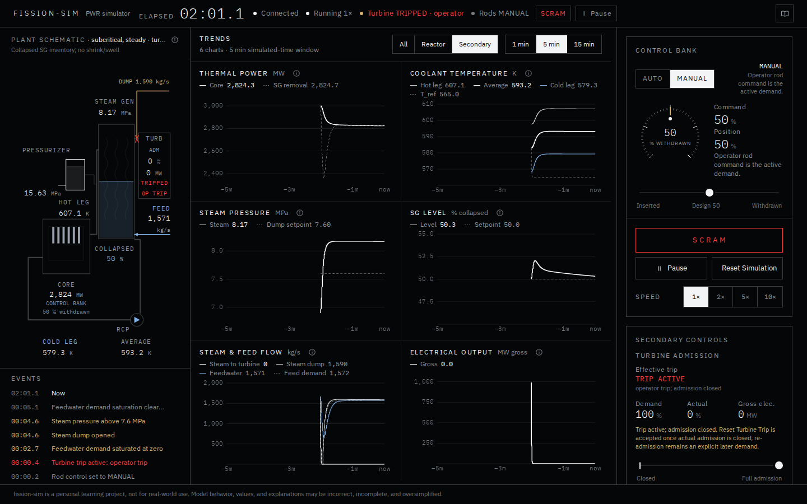

# fission-sim

> This project is **not** for any real-world use and was built as a side-project for personal learning. Information was collected from public sources on search engines, Wikipedia, etc. The author does not have any training or experience in this space so components are likely incorrect, incomplete, and over simplifications.

fission-sim is a pressurized-water-reactor learning simulator which allows you to interact with the reactor by inserting and removing control rods. Changes to
the reactor state then affect reactivity, temperature, and pressure within the system. This is a hobby learning project to work with complex multi-stage systems
and likely contains bugs and mistakes.

Both a CLI and React UI are available to interact with the simulation.



Developer workflow, Web API details, architecture notes, the component
contract, and a step-by-step engine tutorial live in
[DEVELOPMENT.md](DEVELOPMENT.md). Planning labels used in this README and in
the project's commit history (fidelity levels L1/L2/L3, milestones M1-M6) are
defined in the [Glossary](#glossary) and the [Roadmap](#roadmap).

## Quickstart

### Prerequisites

- Python 3.11+
- Node.js 20+ (or 22+)
- `uv` installed (see [astral.sh/uv](https://astral.sh/uv))

### Install

    make install

This runs `uv sync && npm install --prefix web` — it installs the Python
package (in a `.venv`) and the frontend's Node dependencies in one step.

For Python-only use, run `uv sync`.

### Run The Dashboard

The dashboard streams simulator telemetry at 10 Hz while running and exposes
operator controls for rod command, SCRAM, pause/resume, reset, and simulation
speed. The backend also supports a pressure-setpoint command for scripts and
experiments.

    make dev

Starts both the FastAPI/uvicorn backend (port 8000) and the Vite dev server
(port 5173) concurrently, with colour-prefixed output. Press **Ctrl-C** to
stop both processes.

Open [http://localhost:5173](http://localhost:5173) in a browser once both
processes are ready (the Vite line `VITE vX.Y.Z ready` appears in the
terminal).

What to expect in the dashboard:

- A wireframe schematic of the primary loop (core, hot leg, steam
  generator, cold leg, pump, pressurizer) with live values, and an event
  log of what the plant did: SCRAM, banks fully inserted, pauses, speed
  and rod-command changes, and readouts crossing their alert bands.
- Six live trend charts (power, reactivity, coolant and fuel temperature,
  pressure, control rods) show a fixed window of the most recent 60 s of
  simulated time, whatever the simulation speed. Hover a chart to read
  values at that moment on every chart at once.
- Every readout and chart has an explanation: hover it, or focus or tap
  its info button. The controls show their help on hover and on keyboard
  focus.
- Backend and connection errors appear as a notice you can dismiss. If the
  simulation reaches a [model limit](#model-limits), a notice explaining
  which assumption failed stays on screen until you press
  **Reset Simulation**.
- **SCRAM** drops both rod banks into the core. **Reset Scram** returns only
  the operator's control bank; the shutdown bank stays in and the reactor
  stays subcritical. **Reset Simulation** is the way back to full power.

> **LAN access** — both servers bind `0.0.0.0`, so the dashboard is reachable
> from any host on your network at `http://<your-machine-ip>:5173` (Vite
> prints the LAN URL on the `Network:` line). There is **no authentication**
> — only expose this on a trusted network.

> **Windows users** — the `make dev` launcher is Unix-only (it relies on
> Python's `os.kill` / `signal` APIs). Run the two processes in separate
> terminals instead:
>
>     uv run python -m fission_sim.api   # backend, port 8000
>     npm run dev --prefix web           # frontend, port 5173

### Run From The CLI

The CLI scripts are useful when you want a quick simulation without a browser,
or when you want to inspect the model's raw outputs. This is the complete list
of examples:

| Command | What it shows |
|---|---|
| `uv run python examples/console.py` | Interactive terminal dashboard for the standard plant: type rod commands, SCRAM, heater/spray overrides, and pressure setpoints while telemetry updates live |
| `uv run python examples/console.py --speed 60` | Same console, 60 simulated seconds per wall second |
| `uv run python examples/report_primary.py` | Text report for the standard plant: a +210 pcm rod step at 10 s and a SCRAM at 60 s, with tables and ASCII charts; good over SSH |
| `uv run python examples/power_maneuver.py` | Text report for a slow −210 pcm rod insertion and re-withdrawal at power, with the startup-rate meter and the pressurizer's pressure response |
| `uv run python examples/run_primary.py` | Matplotlib plots of the same rod-step-then-SCRAM scenario. The one example that wires the plant by hand, component by component |
| `uv run python examples/dump_state.py` | Diagnostic dump of that scenario: every wired signal and every module's full telemetry at a few sample times |
| `uv run python examples/run_core.py` | Matplotlib plots for the point-kinetics core alone, with hand-coded inputs: a +200 pcm step at 10 s and a SCRAM at 60 s, coolant held at its reference temperature |
| `uv run python examples/report_core.py` | Text-only version of `run_core.py` |

The plant examples stop with a "model limit" explanation if a scenario leaves
the conditions the model can describe (see [Model Limits](#model-limits)).

## How The Model Fits Together

The simulator is not a plant procedure trainer. It is a small dynamic model
built to make the major feedback loops visible.

The shortest mental model is:

1. **Rod command changes reactivity.** Rods absorb neutrons. Inserting them
   adds negative reactivity and tends to reduce power; withdrawing them tends
   to increase power.
2. **The core turns reactivity into heat.** Point kinetics tracks neutron
   population, delayed-neutron precursors, and fuel temperature. Delayed
   neutrons are why reactor power changes on human-observable timescales
   instead of only prompt-neutron timescales.
3. **The primary loop moves heat.** Hot-leg and cold-leg coolant temperatures
   represent the sealed water loop carrying heat from the core to the steam
   generator. The loop is heated by the heat that crosses from the fuel into
   the water, which during a transient differs from the fission power.
4. **The steam generator removes heat.** In this model it is a simplified heat
   sink. If core heat and steam-generator heat removal do not match, primary
   temperatures move.
5. **The pressurizer holds pressure.** A simplified pressurizer/controller pair
   uses heater and spray behavior to move primary pressure back toward setpoint
   during transients.

### Main Pieces

| Layer | Code | Role |
|---|---|---|
| Dashboard/API | `web/`, `src/fission_sim/api/` | Browser UI, WebSocket telemetry, operator commands |
| Standard plant | `src/fission_sim/plant.py` | `build_standard_plant()`: wires the seven components into a ready-to-run engine |
| Engine | `src/fission_sim/engine/` | Wires components, owns the state vector, advances time |
| Control | `src/fission_sim/control/` | Pressurizer control logic |
| Physics | `src/fission_sim/physics/` | Core, rods, primary loop, steam generator, pressurizer |
| Examples | `examples/` | CLI/report/plot drivers for common scenarios |

Each physics component owns its parameters and equations, but not its evolving
state. State lives in one numpy vector owned by `SimEngine`. Components expose
`initial_state()`, `derivatives(...)`, `outputs(...)`, and `telemetry(...)`.
The engine wires outputs into inputs, then integrates the coupled ODE system
with SciPy's BDF solver. The exact rules a component must follow are in
[DEVELOPMENT.md → Component Contract](DEVELOPMENT.md#component-contract).

### What To Watch

| Signal | Why it matters |
|---|---|
| `power_thermal` | Modeled fission power, `n · P_design`. After SCRAM it drops sharply, then falls more slowly as delayed-neutron precursors decay. Fission-product decay heat is not modeled, so this is not the total heat a real core produces after shutdown. |
| `rho_total` | Net reactivity. Near zero means roughly critical; negative means power tends down. |
| `rho_rod`, `rho_doppler`, `rho_moderator` | The three visible reactivity contributions. |
| `T_hot`, `T_cold`, `T_avg`, `T_fuel` | Heat moving from fuel into coolant and around the primary loop. |
| `P_primary_MPa` | Pressurizer-controlled primary-loop pressure. |
| `Q_sg` | Heat removed by the steam generator. Compare with core power. |
| `rod_command` vs. `rod_position` | Requested control-bank position vs. where the bank actually is (it moves at 1 %/s). |

The component guide below explains each model in more depth.

### Model Limits

The simulator models a liquid-filled primary loop and a pressurizer that holds
a steam bubble over water. Its equations cannot tell by themselves when a
transient leaves that picture, so the state after every step is checked
against these limits (`src/fission_sim/physics/domain.py`):

| Limit | Why |
|---|---|
| Hot-leg water stays below its boiling point, `T_hot < T_sat(P)` | The loop equations describe liquid water only; boiling and steam voids are not modeled. |
| The pressurizer holds both steam and water (steam quality strictly between 0 and 1) | At 0 it has filled solid with water, at 1 it has boiled dry. Its pressure comes from the steam bubble. |
| Primary pressure between 1 and 21 MPa | Below, far outside pressurized-water-reactor operation; above, close to water's critical point (22.064 MPa), where liquid and steam stop being distinct. |
| Positive loop inventory, finite numbers, and water-property lookups that succeed | Otherwise the equations cannot be evaluated at all. |

If a step breaks a limit, the simulation stops at the last valid state and
explains which assumption failed: a notice in the dashboard (the
`model_limit` field of the telemetry frame), or "Model limit reached" in the
console. Resume is refused until you reset. Boiling, a water-solid
pressurizer, and automatic reactor protection (a trip on high power or
pressure) are not modeled, so the operator's own commands can reach the edge
of the model. For example, full rod withdrawal together with a 10 MPa
pressure setpoint makes the controller spray continuously, and the
pressurizer fills solid after about 6 simulated minutes.

Other simplifications to keep in mind (these do not stop the simulation):

- Displayed power is modeled fission power only; decay heat is omitted.
- There is no external neutron source, so this is not a cold-startup model:
  a core at `n = 0` cannot start itself.
- Constant reactivity coefficients describe one hot-full-power operating
  point. Xenon, boron changes, burnup, spatial power shape, and fuel failure
  are not modeled.
- The loop has constant flow and constant `c_p`, and its thermal masses are
  its water only, without the metal of vessel and piping, so it responds
  somewhat faster than a real plant. Its energy balances leave out the
  enthalpy carried by surge and spray flow.
- Surge comes from thermal expansion only: the loop's water inventory is not
  checked against its fixed volume, so the compressibility of water as
  pressure changes is ignored.
- The steam generator has a fixed `UA`, and the secondary side is a
  fixed-temperature reservoir: no secondary inventory, turbine, or feedwater.
- After a SCRAM only a full reset returns the plant to power (see
  [RodController](#rodcontroller-srcfission_simphysicsrod_controllerpy)).

## Educational Component Guide

Each component section follows the same learning path:

- **What it represents** — the real plant part or modeling idea.
- **Equations used** — the formulas the code evaluates.
- **State and parameters** — what changes over time vs. what stays fixed.
- **API** — how the component is called from examples or the simulation engine.

### PointKineticsCore (`src/fission_sim/physics/core.py`)

Point kinetics at fidelity level L1 (see the [Glossary](#glossary)) with six
lumped delayed-neutron groups + Doppler + moderator temperature feedback.

**What it represents**

The core is where fission heat is produced. At L1 we do not model the shape of
the core or where neutrons are inside it. Instead, the whole core is collapsed
into one "point" with one normalized neutron population `n`. If `n = 1`, the
reactor is at design thermal power; if `n = 0.5`, it is at half power.

The important educational idea is delayed neutrons. Most neutrons appear
immediately after fission, but a small fraction arrive later from radioactive
decay products. Those delayed neutrons stretch reactor response from
microseconds to seconds and make control possible, so the model tracks six
delayed-neutron precursor groups.

Delayed neutrons also explain why power does not vanish after a SCRAM. The
core is subcritical from the moment the rods start to fall (they are fully
in within about 2 s), but the precursors
made before the SCRAM keep decaying and emitting neutrons, and those neutrons
still cause fissions. A subcritical reactor therefore still has fission power,
which falls over tens of seconds to minutes as the precursors decay.
Reactivity (how far from critical) and power (how many fissions per second)
are different quantities.

**Equations used**

Point kinetics tracks neutron population and precursor buildup/decay:

```text
dn/dt   = ((ρ − β) / Λ) · n + Σᵢ λᵢ · Cᵢ
dCᵢ/dt = (βᵢ / Λ) · n − λᵢ · Cᵢ
```

Reactivity `ρ` is the "how far from exactly critical are we?" number:

```text
ρ = ρ_rod + α_f · (T_fuel − T_fuel_ref) + α_m · (T_cool − T_cool_ref)
```

`ρ_rod` comes from the rods. The two temperature terms are feedbacks. Because
`α_f` and `α_m` are negative, hotter fuel or coolant pushes reactivity down,
which tends to stabilize power.

- **Doppler (`α_f`)**: hotter fuel broadens the neutron-absorption resonances
  of its uranium, mostly U-238, so the fuel captures more neutrons before
  they can cause fission.
- **Moderator (`α_m`)**: hotter water is less dense and slows neutrons down
  less effectively. Dissolved boron works the other way: hotter, less dense
  water also carries less boron absorber, so a high soluble-boron
  concentration makes the coefficient less negative, and it can even turn
  positive at low temperature. The model's `α_m = −5×10⁻⁵ /K` (−2.8 pcm/°F)
  is weaker than commonly quoted hot-full-power values of about −1×10⁻⁴ to
  −5×10⁻⁴ /K; it represents a high-boron, beginning-of-cycle core.

Fuel temperature is a simple energy balance:

```text
M_fuel · c_p_fuel · dT_fuel/dt = n · P_design − hA_fc · (T_fuel − T_cool)
```

In plain language: fuel heats up when fission power exceeds heat transfer to
coolant, and cools down when heat transfer exceeds fission power.

The heat-transfer term is its own output, the heat that actually reaches the
coolant:

```text
Q_fuel_to_coolant = hA_fc · (T_fuel − T_cool)
```

This, not the fission power `n · P_design`, heats the primary loop. The two are
equal only at steady state. After a SCRAM, fission power falls below a tenth
of design within about 1.5 s, while the fuel keeps releasing its stored heat
into the coolant for several fuel time constants,
`τ_fuel = M_fuel · c_p_fuel / hA_fc ≈ 5.17 s`.

**API**

**Constructor**

    PointKineticsCore(params: CoreParams)

**State and parameters**

State changes during a simulation. Parameters are fixed constants for one run.

**State vector** (`state_size = 8`)

    state_labels = ("n", "C1", "C2", "C3", "C4", "C5", "C6", "T_fuel")
    units:        dimensionless × 7,                                 K

| Index | Name   | Meaning                                                       |
|------:|--------|---------------------------------------------------------------|
| 0     | n      | Neutron population (n=1 at design power)                      |
| 1–6   | C1..C6 | Delayed neutron precursor concentrations (Keepin 6-group)     |
| 7     | T_fuel | Average fuel temperature [K]                                  |

**Methods**

    initial_state() -> np.ndarray
        Design-point steady state. n=1, C_i = beta_i / (Lambda * lambda_i),
        T_fuel = T_fuel_ref.

    derivatives(state, inputs) -> np.ndarray
        Pure function. inputs:
            "rho_rod": float [dimensionless]
            "T_cool":  float [K]

    outputs(state, inputs) -> {
        "power_thermal":     float [W],   # fission power n · P_design
        "T_fuel":            float [K],
        "Q_fuel_to_coolant": float [W],   # hA_fc · (T_fuel − T_cool)
    }
        Computed: needs inputs["T_cool"]. The class declares
        outputs_require_inputs = True, and raises TypeError if inputs is None.

    telemetry(state, inputs=None) -> {
        "power_thermal", "T_fuel", "Q_fuel_to_coolant", "n",
        "C1", "C2", "C3", "C4", "C5", "C6",
        "rho_total", "rho_rod", "rho_doppler", "rho_moderator",
        "startup_rate_dpm",
    }
        rho_doppler is computable from state alone. Q_fuel_to_coolant,
        rho_rod, rho_moderator, rho_total, and startup_rate_dpm (the
        startup-rate meter, decades per minute) are None when inputs is
        omitted.

**CoreParams (frozen dataclass)**

| Field         | Units      | Default                                | Source / note                    |
|---------------|------------|----------------------------------------|----------------------------------|
| `beta_i`      | —          | 6 values, Σ ≈ 0.0065                   | Lamarsh Tab 7.3 / Keepin 1965    |
| `lambda_i`    | 1/s        | 6 values, 0.0124 .. 3.01               | Lamarsh Tab 7.3 / Keepin 1965    |
| `Lambda`      | s          | 4.0e-5                                 | Mid-range PWR (Bell & Glasstone §9.2) |
| `P_design`    | W          | 3.0e9                                  | ~3000 MWth large PWR             |
| `alpha_f`     | 1/K        | −2.5e-5                                | Doppler, negative; IAEA range −2 to −4×10⁻⁵ |
| `alpha_m`     | 1/K        | −5.0e-5                                | Moderator; weak high-boron beginning-of-cycle value (typical hot full power −1e-4 to −5e-4) |
| `T_fuel_ref`  | K          | 1100                                   | Volume-avg fuel temp (Fink 2000) |
| `T_cool_ref`  | K          | 583                                    | Match loop's T_avg_ref           |
| `M_fuel`      | kg         | 1.0e5                                  | Lumped fuel mass                 |
| `c_p_fuel`    | J/(kg·K)   | 300                                    | UO₂                              |
| `hA_fc`       | W/K        | derived: P_design / (T_f_ref - T_c_ref) ≈ 5.80e6 | Steady-state energy balance; gives τ_fuel ≈ 5.17 s |
| `n_initial`   | —          | 1.0                                    | Initial neutron population; precursors scale with it |
| `T_fuel_initial` | K       | None → T_fuel_ref                      | Initial fuel temperature         |

### PrimaryLoop (`src/fission_sim/physics/primary_loop.py`)

Lumped primary loop (L1): hot leg + cold leg + liquid inventory, constant
flow, single-phase liquid. The thermal balances use a fixed flow rate and heat
capacity. The loop does not set its own pressure: in the coupled plant it reads
the pressurizer's pressure (`P_primary`), which sets the density of water
surging into or out of the pressurizer. The inventory state `M_loop` and the
`m_dot_spray` and `P_primary` inputs close mass conservation with the
pressurizer.

**What it represents**

The primary loop is the sealed water circuit that carries heat from the core to
the steam generator. In a real PWR it includes pumps, pipes, the reactor vessel,
and steam-generator tubes. At L1 this is simplified into two temperature lumps:
hot leg and cold leg.

The hot leg is water leaving the core. The cold leg is water returning from the
steam generator. Their temperature difference tells us how much heat the moving
water is carrying.

**Equations used**

First compute the heat carried by flow:

```text
Q_flow = m_dot · c_p · (T_hot − T_cold)
```

Then apply one energy balance to each leg:

```text
M_hot  · c_p · dT_hot/dt  = Q_fuel_to_coolant − Q_flow
M_cold · c_p · dT_cold/dt = Q_flow − Q_sg
```

`Q_fuel_to_coolant`, the heat leaving the fuel, heats the hot leg. `Q_sg` is
heat removed by the steam generator. If those are equal at steady state,
temperatures stop drifting.

`M_hot` and `M_cold` are thermal inertias in kilograms of water. `T_hot` and
`T_cold` stand for the temperature of the whole liquid inventory outside the
pressurizer, split into two equal halves, so each is half the design
inventory: `V_loop · ρ(P_ref, T_avg_ref) / 2 ≈ 61,700 kg`. Only water is
counted; the metal of the vessel, piping, and steam-generator tubes would slow
a real plant further. With the steam generator's `UA` this gives a loop
thermal time constant `(M_hot + M_cold) · c_p / UA ≈ 5.66 s`, a little longer
than the fuel's 5.17 s: the coolant responds more slowly than the fuel, as in a
real plant.

The loop also tracks liquid inventory so it can exchange water with the
pressurizer:

```text
dM_loop/dt = −m_dot_surge − m_dot_spray
```

Positive surge or spray means mass leaves the loop and enters the pressurizer.

**API**

**Constructor**

    PrimaryLoop(params: LoopParams)

**State and parameters**

`T_hot`, `T_cold`, and `M_loop` are state. The flow rate, heat capacity, thermal
inertias, and reference temperatures are parameters.

**State vector** (`state_size = 3`)

    state_labels = ("T_hot", "T_cold", "M_loop")
    units:        K, K, kg

| Index | Name    | Meaning                                                              |
|------:|---------|----------------------------------------------------------------------|
| 0     | T_hot   | Coolant temperature exiting the core [K]                             |
| 1     | T_cold  | Coolant temperature returning to the core [K]                        |
| 2     | M_loop  | Liquid mass in the loop pipes (excluding pressurizer) [kg]           |

**Methods**

    initial_state() -> np.ndarray
        [T_hot_ref, T_cold_ref, M_loop_initial]

    derivatives(state, inputs) -> np.ndarray
        inputs: {
            "Q_fuel_to_coolant": float [W],    # core.Q_fuel_to_coolant
            "Q_sg":              float [W],
            "m_dot_spray":       float [kg/s], # spray flow leaving the loop into the pzr
            "P_primary":         float [Pa],   # pzr.P (state-derived); drives surge density
        }

        dM_loop/dt = −m_dot_surge − m_dot_spray
        where m_dot_surge is computed internally via compute_m_dot_surge() from
        surge.py (identical call to what Pressurizer.derivatives() makes), keeping
        M_loop + M_pzr = const to solver tolerance.

    outputs(state, inputs=None) -> {
        "T_hot":  float [K],
        "T_cold": float [K],
        "T_avg":  float [K],
        "T_cool": float [K],   # = T_avg at L1; what the core sees
    }
        State-derived: depends on the state only.

    telemetry(state, inputs=None) -> outputs() ∪ {
        "delta_T", "Q_flow", "Tref", "M_loop",
        "Q_fuel_to_coolant", "Q_sg",
    }
        delta_T, Q_flow, Tref, and M_loop are computable from state alone.
        Q_fuel_to_coolant and Q_sg are echoed from inputs (None when inputs
        omitted).

**LoopParams (frozen dataclass)**

| Field              | Units    | Default                                 | Source / note                          |
|--------------------|----------|-----------------------------------------|----------------------------------------|
| `m_dot`            | kg/s     | 1.85e4                                  | W4-loop full-power flow (~140 Mlb/hr)  |
| `c_p`              | J/(kg·K) | 5500                                    | Water at ~310°C, 15.5 MPa; CoolProp gives 5,736 at 583 K, so ~4 % low |
| `M_hot`            | kg       | derived: V_loop·ρ(P_ref,T_avg_ref)/2 ≈ 6.17e4 | Hot half of the loop water (thermal inertia) |
| `M_cold`           | kg       | derived: same ≈ 6.17e4                  | Cold half of the loop water            |
| `Q_design`         | W        | 3.0e9                                   | Match core's P_design                  |
| `T_avg_ref`        | K        | 583                                     | W4-loop full-power T_avg ~310 °C       |
| `P_ref`            | Pa       | 1.55e7                                  | Primary design pressure for initial density |
| `T_hot_ref`        | K        | derived: T_avg_ref + ΔT_design/2 ≈ 597.7 | ΔT = Q_design/(m_dot·c_p) ≈ 29.5 K   |
| `T_cold_ref`       | K        | derived: T_avg_ref − ΔT_design/2 ≈ 568.3 | (same)                                |
| `V_loop`           | m³       | 175.0                                   | All liquid outside the pzr, including the SG primary side; illustrative, not from a plant document |
| `beta_T_primary`   | 1/K      | 3.3e-3                                  | Frozen at design; CoolProp gives 3.26e-3 at 583 K, 15.5 MPa (2.67e-3 at 568 K, 4.27e-3 at 598 K) |
| `M_loop_initial`   | kg       | derived: V_loop·ρ(P_ref,T_avg_ref) ≈ 1.23e5 | Initial physical loop liquid inventory; None → derived |

### Pressurizer (`src/fission_sim/physics/pressurizer.py`)

L1 two-phase saturated water/steam vessel with electric heaters and cold-leg
spray. The primary system's pressure controller: by adjusting how much of its
inventory is liquid vs. vapor, it sets the saturation pressure of the whole
primary loop. Liquid surges into/out of the pressurizer through the surge line
as primary water thermally expands and contracts.

Composes a `LoopParams` reference so it can compute surge mass flow from the
loop's energy imbalance; consumes that reference inside `derivatives()` via the
shared `surge.py` helper. The pressurizer is classified as **state-derived** by
the engine (P, level, T_sat follow directly from the state vector via the
saturation closure), which breaks the algebraic loop with `PressurizerController`
— P is available to the controller before the controller's outputs (Q_heater,
m_dot_spray) are needed by the pressurizer's *derivatives*.

**What it represents**

The pressurizer is the primary loop's pressure cushion. It is a tank connected
to the hot leg, partly filled with liquid water and partly with steam. Heating
the tank makes more steam pressure; spraying cooler water into the steam space
condenses steam and lowers pressure.

The central learning idea is that, while the primary loop remains liquid, the
pressurizer intentionally contains a saturated water/steam mixture. The pressure
of that saturated mixture sets the pressure of the whole primary side.

**Equations used**

The state stores total mass `M_pzr` and total internal energy `U_pzr`. From those
and the fixed vessel volume, the code asks CoolProp for the saturation pressure:

```text
rho_avg = M_pzr / V_pzr
u_avg   = U_pzr / M_pzr
P       = CoolProp(D=rho_avg, U=u_avg)
```

Then it uses the lever rule to split the mixture into liquid and vapor:

```text
x     = (1/rho_avg − 1/rho_l) / (1/rho_v − 1/rho_l)
level = (M_l / rho_l) / V_pzr
```

`x` is steam quality: the fraction of the mass that is vapor. `level` is the
fraction of the vessel volume occupied by liquid water.

Mass and energy follow open-system balances:

```text
dM_pzr/dt = m_dot_surge + m_dot_spray
dU_pzr/dt = Q_heater + m_dot_surge · h_surge + m_dot_spray · h_coldleg
```

Surge is water moving between loop and pressurizer as the primary coolant
expands or contracts. Spray is cold-leg water deliberately injected into the
pressurizer. Heater power adds energy without adding mass.

**API**

**Constructor**

    Pressurizer(params: PressurizerParams)

**State and parameters**

State is total mass and total internal energy. Pressure, level, quality, and
saturation temperature are derived from that state.

**State vector** (`state_size = 2`)

    state_labels = ("M_pzr", "U_pzr")
    units:        kg, J

| Index | Name   | Meaning                                              |
|------:|--------|------------------------------------------------------|
| 0     | M_pzr  | Total mass (water + steam) in vessel [kg]            |
| 1     | U_pzr  | Total internal energy (water + steam) in vessel [J]  |

**Methods**

    initial_state() -> np.ndarray
        [M_pzr_initial, U_pzr_initial] derived from (P_design, level_design, V_pzr)
        in PressurizerParams.__post_init__.

    derivatives(state, inputs) -> np.ndarray
        inputs: {
            "Q_fuel_to_coolant": float [W],   # with Q_sg, sets the surge flow
            "Q_sg":          float [W],
            "T_hotleg":      float [K],   # sets ρ and h of insurge water
            "T_coldleg":     float [K],   # sets h of spray water
            "Q_heater":      float [W],   # from controller
            "m_dot_spray":   float [kg/s], # from controller
        }

        Equations (open-system first law, rigid vessel; Todreas & Kazimi §6.2 Eq. 6-13):
            dM_pzr/dt = m_dot_surge + m_dot_spray
            dU_pzr/dt = Q_heater + m_dot_surge·h_surge + m_dot_spray·h_coldleg

        h_surge is hot-leg subcooled-liquid enthalpy for insurge and saturated-
        liquid enthalpy for outsurge.

    outputs(state, inputs=None) -> {
        "P":     float [Pa],          # pressurizer / primary system pressure
        "level": float [0..1],        # fractional water level V_l / V_pzr
        "T_sat": float [K],           # saturation temperature at current P
    }
        State-derived: succeeds with inputs=None (no inputs required).

    telemetry(state, inputs=None) -> outputs() ∪ {
        "x", "M_l", "M_v", "M_pzr", "U_pzr",          # always present
        "m_dot_surge", "subcooling_margin",              # None when inputs omitted
        "heater_on", "spray_open", "Q_heater", "m_dot_spray",  # None when inputs omitted
    }

**PressurizerParams (frozen dataclass)**

| Field            | Units | Default                               | Source / note                                          |
|------------------|-------|---------------------------------------|--------------------------------------------------------|
| `V_pzr`          | m³    | 51.0                                  | ~1800 ft³; Westinghouse 4-loop FSAR §5.4.10 range      |
| `P_design`       | Pa    | 1.55e7                                | 15.5 MPa; W4-loop nominal                              |
| `level_design`   | —     | 0.5                                   | Half-full; equal margin for insurge/outsurge           |
| `loop_params`    | —     | LoopParams()                          | Composed reference; pass the same instance as the loop |
| `M_pzr_initial`  | kg    | None → derived                        | Derived in __post_init__ from saturation closure at design |
| `U_pzr_initial`  | J     | None → derived                        | Derived alongside M_pzr_initial                        |

The initial inventory is derived at 15.5 MPa with CoolProp's IAPWS-IF97
backend, but pressure is recovered from `(D, U)` with CoolProp's Helmholtz
(HEOS) backend, because IF97 does not accept that input pair. The two
formulations differ slightly, so the design state reads 15.4993 MPa, about
0.65 kPa below 15.5 MPa. That is small next to the controller's 150 kPa
deadband.

**SaturationState (frozen dataclass)**

Returned by `saturation_state(M, U, V)`. Fields: `P` [Pa], `T_sat` [K],
`rho_l` [kg/m³], `rho_v` [kg/m³], `h_l` [J/kg], `h_v` [J/kg],
`x` [—], `level` [—], `M_l` [kg], `M_v` [kg].

**`saturation_state(M, U, V) -> SaturationState`**

Module-level function. Inverts CoolProp's saturation surface using the (D, U)
pair (`D = M/V`, `u = U/M`) to find pressure, then evaluates all saturation
properties at that pressure. Decomposes total mass into liquid and vapor via the
lever rule on specific volume (Moran & Shapiro §3.6 Eq. 3.7).

### PressurizerController (`src/fission_sim/control/pressurizer_controller.py`)

Stateless proportional-with-deadband pressure controller (L1), in the
`src/fission_sim/control/` subpackage.

**What it represents**

This is the simple automatic pressure controller. It reads measured pressure and
a pressure setpoint, then asks for heater power when pressure is low or spray
flow when pressure is high.

There is no time-evolving controller state at L1. It is just a formula that
turns pressure error into actuator demand.

**Equations used**

Start with pressure error:

```text
err = P_setpoint − P
```

If pressure is close enough to the setpoint, the controller does nothing. That
"quiet zone" is the deadband:

```text
if |err| <= deadband:
    heater_duty = 0
    spray_duty = 0
```

Outside the deadband, proportional gains turn error into duty fractions:

```text
heater_duty = clip(K_p_heater · (err − deadband), 0, 1)      # low pressure
spray_duty  = clip(K_p_spray · (−err − deadband), 0, 1)      # high pressure
```

The final outputs scale those fractions by physical actuator limits.

**API**

**Constructor**

    PressurizerController(params: PressurizerControllerParams)

**State and parameters**

There is no state. Parameters are actuator capacities, deadband, gains, and the
default pressure setpoint.

**State vector** (`state_size = 0`)

    state_labels = ()
    derivatives() returns np.zeros(0) — stateless.

**Methods**

    initial_state() -> np.ndarray    # np.zeros(0)
    derivatives(state, inputs) -> np.ndarray   # np.zeros(0)

    outputs(state, *, inputs) -> {
        "Q_heater":    float [W],      # in [0, Q_heater_max]
        "m_dot_spray": float [kg/s],   # in [0, m_dot_spray_max]
    }
        inputs: {
            "P":             float [Pa],         # measured pzr pressure
            "P_setpoint":    float [Pa],         # pressure setpoint
            "heater_manual": float | None,       # duty override, clipped to 0..1 (None = auto)
            "spray_manual":  float | None,       # duty override, clipped to 0..1 (None = auto)
        }
        Computed: the class declares outputs_require_inputs = True, so the
        engine evaluates the controller after the pressurizer's
        state-derived P. `inputs` is a required keyword argument.

    telemetry(state, inputs=None) -> {
        "Q_heater", "m_dot_spray", "P", "P_setpoint",
        "heater_manual", "spray_manual",
    }
        All values are None when inputs is omitted.

**Control logic** (`err = P_setpoint − P`):

- `|err| ≤ deadband`: both actuators idle (0).
- `err > deadband` (underpressure): `heater_duty = clip(K_p_heater · (err − deadband), 0, 1)`.
- `err < −deadband` (overpressure): `spray_duty = clip(K_p_spray · (−err − deadband), 0, 1)`.
- Manual overrides: `heater_manual` / `spray_manual` bypass the auto path when not None, then clip to `[0, 1]`.
- Final demands: `Q_heater = heater_duty · Q_heater_max`, `m_dot_spray = spray_duty · m_dot_spray_max`.

**PressurizerControllerParams (frozen dataclass)**

| Field                | Units | Default  | Source / note                                                  |
|----------------------|-------|----------|----------------------------------------------------------------|
| `Q_heater_max`       | W     | 1.8e6    | 1800 kW; Tong & Weisman §7.3 (W4-loop installed capacity)     |
| `m_dot_spray_max`    | kg/s  | 25.0     | W4-loop spray sizing (~150 gpm per valve × 2 valves)          |
| `deadband`           | Pa    | 1.5e5    | ±150 kPa; matches W4-loop variable-heater band                 |
| `K_p_heater`         | 1/Pa  | 2.0e-4   | Saturates at ~5 kPa beyond deadband (effectively bang-bang)    |
| `K_p_spray`          | 1/Pa  | 2.0e-4   | Same as K_p_heater for symmetry                                |
| `P_setpoint_default` | Pa    | 1.55e7   | Primary design pressure; used as engine default when not wired |

### CoolProp wrapper (`src/fission_sim/physics/coolprop.py`)

Thin pass-through to CoolProp. All water/steam property calls in the project
go through this module. Successful lookups are memoized with a 16,384-entry
LRU cache because the BDF solver's finite-difference Jacobian repeats exact
property arguments; CoolProp properties are pure functions of those arguments,
so caching does not change results. Concentrating the dependency here also
lets the backend be swapped or simplified correlations substituted without
touching any physics module. Saturation-line queries use CoolProp's fast
IAPWS-IF97 backend; `density_PT`, `enthalpy_PT`, `beta_T`, and `P_from_DU` use
its Helmholtz (HEOS) backend, which accepts states closer to the saturation
line and input pairs IF97 does not. A property lookup that CoolProp cannot
evaluate raises `ModelDomainError`, which the runtime reports as a
[model limit](#model-limits); failed lookups are not cached.

All inputs and outputs are SI (Pa, K, kg/m³, J/kg, 1/K).

**What it represents**

Water and steam properties are nonlinear. Density, enthalpy, saturation
temperature, and internal energy all change with pressure and temperature. This
project does not hand-code those property correlations; it calls CoolProp
through this small wrapper.

**Formulas used**

There is no reactor equation here. Each function asks CoolProp to evaluate a
thermodynamic property, for example:

```text
rho = density(P, T)
h   = enthalpy(P, T)
T_sat = saturation_temperature(P)
P = pressure(D, U)
```

The wrapper exists so the rest of the code can say what property it needs
without caring which CoolProp backend is fastest or safest for that query.

**State and parameters**

There is no simulation state in this wrapper. Its "inputs" are thermodynamic
coordinates such as `(P, T)`, `(P, Q)`, or `(D, U)`, and its outputs are water
or steam properties in SI units.

**Functions**

| Function                       | Arguments | Returns          | Notes                                  |
|--------------------------------|-----------|------------------|----------------------------------------|
| `density_PT(P, T)`             | Pa, K     | kg/m³            | Subcooled liquid density               |
| `enthalpy_PT(P, T)`            | Pa, K     | J/kg             | Subcooled liquid specific enthalpy     |
| `T_sat(P)`                     | Pa        | K                | Saturation temperature                 |
| `sat_liquid_density(P)`        | Pa        | kg/m³            | Q = 0 branch                          |
| `sat_vapor_density(P)`         | Pa        | kg/m³            | Q = 1 branch                          |
| `sat_liquid_enthalpy(P)`       | Pa        | J/kg             | Q = 0 branch                          |
| `sat_vapor_enthalpy(P)`        | Pa        | J/kg             | Q = 1 branch                          |
| `sat_liquid_internal_energy(P)`| Pa        | J/kg             | Q = 0 branch                          |
| `sat_vapor_internal_energy(P)` | Pa        | J/kg             | Q = 1 branch                          |
| `beta_T(P, T)`                 | Pa, K     | 1/K              | (1/V)·(∂V/∂T)_P; 3.26e-3 at 583 K, 15.5 MPa |
| `P_from_DU(D, U)`              | kg/m³, J/kg| Pa             | Inverts saturation surface (D, U) → P |
| `clear_cache()`                | —         | None             | Clears memoized CoolProp values       |
| `cache_info()`                 | —         | cache stats      | Reports LRU hits, misses, and size    |

### Surge helper (`src/fission_sim/physics/surge.py`)

Module-level pure function shared between `Pressurizer.derivatives()` and
`PrimaryLoop.derivatives()`. Extracted to avoid duplicating the surge-mass
formula and to guarantee that both modules apply exactly the same value,
keeping the sealed-primary-system invariant `M_loop + M_pzr = const` to
solver tolerance.

**What it represents**

Primary water expands when it heats and contracts when it cools. Because the
primary system is sealed, that volume change must go somewhere. The surge helper
turns loop heat imbalance into a signed mass flow between the loop and the
pressurizer.

**Equations used**

The helper first computes how fast the loop's mass-weighted mean temperature
is changing, from the net heat entering the whole inventory:

```text
T_mean     = (M_hot · T_hot + M_cold · T_cold) / (M_hot + M_cold)
dT_mean/dt = (Q_fuel_to_coolant − Q_sg) / ((M_hot + M_cold) · c_p)
```

Adding the two leg energy balances gives this exactly, for any masses (the
flow term between the legs cancels). With the default equal masses it is also
the rate of change of the published `T_avg = (T_hot + T_cold) / 2`. With
unequal masses the two differ, and the mass-weighted mean is the one that
drives expansion: it changes only when heat enters or leaves the inventory,
not when heat merely moves between the legs.

That temperature change becomes a volume expansion or contraction:

```text
surge_volume_rate = beta_T_primary · V_loop · dT_mean/dt
```

`beta_T_primary` is frozen at 3.3e-3 /K. At 15.5 MPa the real value rises from
2.67e-3 /K at 568 K to 4.27e-3 /K at 598 K, so the fixed value over-predicts the
surge when the loop is colder than 583 K and under-predicts it when hotter.

Finally it converts volume flow to mass flow using the density of the water that
is actually crossing the surge line:

```text
m_dot_surge = rho_surge · surge_volume_rate
```

Insurge uses hot-leg subcooled density. Outsurge uses saturated-liquid density
from the pressurizer.

**State and parameters**

There is no state. The helper reads current heat flows, hot-leg temperature,
primary pressure, saturated-liquid density, and loop parameters.

**API**

**`compute_m_dot_surge(*, Q_fuel_to_coolant, Q_sg, T_hotleg, P_primary, rho_l_sat, loop_params) -> float`**

Returns signed surge mass flow [kg/s] into the pressurizer (positive = insurge,
negative = outsurge).

Algorithm:
1. `dT_mean/dt = (Q_fuel_to_coolant − Q_sg) / ((M_hot + M_cold) · c_p)` — loop energy imbalance (mass-weighted mean temperature).
2. `surge_volume_rate = beta_T_primary · V_loop · dT_mean/dt` — volumetric expansion.
3. Direction-branched density conversion:
   - Insurge (≥ 0): hot-leg subcooled liquid `ρ_hotleg(P_primary, T_hotleg)` from CoolProp.
   - Outsurge (< 0): saturated liquid `rho_l_sat` (passed in; pressurizer has it already
     from `saturation_state()`; loop computes it via `coolprop.sat_liquid_density(P_primary)`).

The density asymmetry (~668 vs ~594 kg/m³ at design) is real and important: using
a single value inflates the conservation-test residual to the size of the tolerance.

References: Todreas & Kazimi Vol. 1 §6.2 Eq. 6-13, §6.4.

### SteamGenerator (`src/fission_sim/physics/steam_generator.py`)

L1 algebraic heat exchanger: `Q_sg = UA · (T_avg − T_secondary)`. No state.

**What it represents**

The steam generator transfers heat from primary water to the secondary side.
Real steam generators contain thousands of tubes and boiling secondary water.
At L1, all of that is collapsed into one heat-transfer equation.

**Equation used**

```text
Q_sg = UA · (T_avg − T_secondary)
```

`UA` is a heat-transfer strength. A bigger temperature difference or bigger
`UA` moves more heat. The model uses one average temperature difference instead
of a detailed tube-by-tube or boiling model.

**API**

**Constructor**

    SteamGenerator(params: SGParams)

**State and parameters**

There is no state. The parameters define the design temperatures, design heat
duty, and derived `UA`.

**State vector** (`state_size = 0`)

    state_labels = ()

**Methods**

    initial_state() -> np.ndarray         # always np.empty(0)
    derivatives(state, inputs=None) -> np.ndarray   # always np.empty(0)

    outputs(state, inputs) -> {"Q_sg": float [W]}
        inputs: {"T_avg":       float [K],
                 "T_secondary": float [K]}
        Computed: the class declares outputs_require_inputs = True (see
        DEVELOPMENT.md → Component Contract), and raises TypeError if inputs
        is None.

    telemetry(state, inputs=None) -> {"Q_sg", "T_avg", "T_secondary", "delta_T"}
        Reports None for input-derived keys when inputs is omitted.

**SGParams (frozen dataclass)**

| Field             | Units | Default                                    | Source / note                  |
|-------------------|-------|--------------------------------------------|--------------------------------|
| `T_primary_ref`   | K     | 583                                        | Match loop's T_avg_ref         |
| `T_secondary_ref` | K     | 558                                        | Match sink's T_secondary       |
| `Q_design`        | W     | 3.0e9                                      | Match core's P_design          |
| `UA`              | W/K   | derived: Q_design / (T_p_ref − T_s_ref)    | = 1.2e8; closes design steady   |

### SecondarySink (`src/fission_sim/physics/secondary_sink.py`)

L1 stand-in for the entire secondary side (turbine + condenser + feedwater).
Constant `T_secondary`; no state, no inputs.

**What it represents**

This is a placeholder for everything on the secondary side: boiling water in the
steam generator, turbine, condenser, and feedwater system. For now it simply
holds the secondary temperature fixed so the primary-side simulator has
somewhere to send heat.

**Equation used**

```text
T_secondary = constant
```

That is intentionally crude. It means the secondary side can absorb any heat the
steam generator sends without its own temperature changing. A dynamic
secondary side (turbine, feedwater, steam-generator level) is not modeled; see
the [Roadmap](#roadmap).

**API**

**Constructor**

    SecondarySink(params: SinkParams)

**State and parameters**

There is no state. The only parameter is the fixed secondary temperature.

**State vector** (`state_size = 0`)

    state_labels = ()

**Methods**

    initial_state() -> np.ndarray             # always np.empty(0)
    derivatives(state, inputs=None) -> np.ndarray  # always np.empty(0)
    outputs(state, inputs=None) -> {"T_secondary": float [K]}
    telemetry(state, inputs=None) -> {"T_secondary": float [K]}

**SinkParams (frozen dataclass)**

| Field           | Units | Default | Source / note                                    |
|-----------------|-------|---------|--------------------------------------------------|
| `T_secondary`   | K     | 558     | Saturation temp at ~6.9 MPa (typical PWR steam)  |

### RodController (`src/fission_sim/physics/rod_controller.py`)

L1 rod controller with two lumped banks: a control bank that the operator
positions and a shutdown bank that only a SCRAM inserts. Each bank moves by
rate-limited first-order tracking and has a linear (L1) rod worth. Bridges
operator decisions (`rod_command`, `scram`) to physics (`rho_rod` into the
core).

**What it represents**

Control rods absorb neutrons. Inserting rods lowers reactivity; withdrawing
rods raises it. This component models two banks, not individual rods:

- The **control bank** is what the operator moves. It is worth 1,200 pcm over
  its full travel, an illustrative value for a single PWR control bank. Each
  1 % of travel is 12 pcm, and from the design position 0.5 the operator can
  add at most ±600 pcm. That stays below prompt critical, which for this
  core's delayed-neutron data is `Σβᵢ = 650.2 pcm`.
- The **shutdown bank** stands for all the other rods, which are fully
  withdrawn at power. It is worth 6,400 pcm and moves only on SCRAM.

It also models the fact that rods cannot teleport. Normal motion is a slow
motor drive at 1 %/s (100 s for the full stroke). That speed is illustrative;
real rod drives are slower, roughly 0.5 %/s (an approximate figure the code
comments note is unverified). A SCRAM immediately commands both banks to full
insertion; they then fall at a finite speed, roughly a gravity drop.

**Equations used**

Normal operation (`scram = False`), control bank:

```text
drod_position/dt = clip((rod_command − rod_position) / tau, −v_normal, +v_normal)
```

SCRAM (`scram = True`), both banks move toward 0 (fully inserted):

```text
dpos/dt = clip(−pos / tau_scram, −v_scram, +v_normal)
```

Far from the target the clip makes the motion constant-velocity (1 %/s
normally, 50 %/s on SCRAM). In the last 1 % of travel
(`tau · v_normal = tau_scram · v_scram = 0.01`) it becomes a smooth
exponential approach, which avoids a discontinuous rate at the target.
Counting a bank as inserted at 99 % of travel (`pos ≤ 0.01`), a bank that
starts at `pos0` is inserted after `(pos0 − 0.01) / v_scram`: 1.98 s from
fully withdrawn, and 0.98 s for the control bank from its design position.

Finally each bank's position becomes reactivity:

```text
rho_control  = rho_control_worth  · (rod_position − rod_position_critical)
rho_shutdown = rho_shutdown_worth · (shutdown_position − 1)
rho_rod      = rho_control + rho_shutdown
```

At the design state (control bank at 0.5, shutdown bank withdrawn)
`rho_rod = 0`. A SCRAM from design inserts `0.012 · 0.5 + 0.064 = 0.070`,
i.e. −7,000 pcm.

**After a SCRAM.** The shutdown bank stays fully withdrawn until a SCRAM
releases it. Once released, it finishes its drop and stays in, even after the
SCRAM latch is cleared: clearing the latch returns only the control bank to
`rod_command`. The reason is the cooldown. As fuel and coolant cool toward the
secondary temperature, the negative temperature coefficients return up to
about +1,480 pcm of reactivity, more than the control bank's −600 pcm can
cancel. With the shutdown bank in, total reactivity stays at or below about
−4,300 pcm whatever the rod command. Returning to power takes a full
simulation reset; the procedure-driven reactor startup that would withdraw
the shutdown banks in a real plant is not modeled.

**API**

**Constructor**

    RodController(params: RodParams)

**State and parameters**

State is the actual position of each bank. Parameters define rod speeds, bank
worths, and the design/critical position.

**State vector** (`state_size = 2`)

    state_labels = ("rod_position", "shutdown_position")
    units:        dimensionless (0=fully inserted, 1=fully withdrawn)

| Index | Name              | Meaning                                                  |
|------:|-------------------|----------------------------------------------------------|
| 0     | rod_position      | Control-bank position; lags rod_command via rate-limited tracking |
| 1     | shutdown_position | Shutdown-bank position; 1 until a SCRAM, then 0          |

**Methods**

    initial_state() -> np.ndarray
        [rod_position_initial (None → rod_position_design), 1.0]

    derivatives(state, inputs) -> np.ndarray
        inputs: {"rod_command": float [0..1, dimensionless],
                 "scram":       bool}

    outputs(state, inputs=None) -> {
        "rho_rod": float [dimensionless],   # rho_control + rho_shutdown
    }
        State-derived: depends on the bank positions only.

    telemetry(state, inputs=None) -> outputs() ∪ {
        "rod_position", "shutdown_position", "rho_control", "rho_shutdown",
        "rod_command", "scram", "rod_command_effective",
    }
        Positions and bank reactivities are computable from state alone.
        rod_command, scram, and rod_command_effective (0 if scram, else
        rod_command) are echoed/derived from inputs (None when inputs
        omitted).

**RodParams (frozen dataclass)**

| Field                    | Units         | Default                  | Source / note                                       |
|--------------------------|---------------|--------------------------|-----------------------------------------------------|
| `tau`                    | s             | 1.0                      | Lag time constant for normal motion; the slow-down zone is `tau · v_normal` = 1 % of travel |
| `v_normal`               | 1/s           | 0.01                     | Motor-drive speed, 1 %/s in both directions (12 pcm/s for the control bank); illustrative; real drives are roughly 0.5 %/s (approximate, unverified) |
| `v_scram`                | 1/s           | 0.5                      | SCRAM drop speed; 99 % inserted 1.98 s after the SCRAM from fully withdrawn |
| `tau_scram`              | s             | 0.02                     | Lag used only during SCRAM; exponential zone = last 1 % of travel |
| `rho_control_worth`      | dimensionless | 0.012                    | Control bank, 1,200 pcm over full travel; 12 pcm per 1 %; ±600 pcm about design |
| `rho_shutdown_worth`     | dimensionless | 0.064                    | Shutdown bank, 6,400 pcm; SCRAM from design totals −7,000 pcm |
| `rod_position_design`    | dimensionless | 0.5                      | Control-bank position at coupled-plant design steady state |
| `rod_position_critical`  | dimensionless | derived: `= rod_position_design` | Control-bank position where it produces zero reactivity |
| `rod_position_initial`   | dimensionless | None → `rod_position_design` | Starting control-bank position; the shutdown bank always starts withdrawn |

## Glossary

### Domain terms (plain English)

- **Reactivity (ρ).** The chain reaction's "excess multiplication" relative to exact self-sustainment. ρ = 0 → power constant. ρ > 0 → power rising. ρ < 0 → power falling. Stored dimensionless; displayed in pcm.
- **pcm.** "Per cent mille" = 10⁻⁵. Display unit for reactivity because real values are tiny: total delayed-neutron fraction β ≈ 0.0065 = 650 pcm; full-rod scram worth ≈ 7000 pcm.
- **Neutron population (n).** How busy the chain reaction is, normalized so n = 1 at design power. Roughly proportional to thermal power. n = 0.01 ⇒ 1% of design power.
- **Delayed-neutron precursors (Cᵢ).** ~99.35% of fission neutrons appear instantly (prompt); ~0.65% come out seconds-to-minutes later from radioactive decay of fission fragments. The fragments are the "precursors." We lump them into 6 groups (Keepin convention) with decay constants λᵢ from ~0.012 to ~3 s⁻¹. Without delayed neutrons the reactor would respond on a microsecond timescale and be uncontrollable. Because precursors keep decaying and emitting neutrons after a SCRAM, a subcritical reactor still has a shrinking fission power.
- **Decay heat.** Heat from the radioactive decay of fission products, which continues after the chain reaction stops. Not modeled here: `power_thermal` is fission power only, so it understates the heat a real core produces after a SCRAM.
- **Doppler feedback.** As fuel heats, the neutron-absorption resonances of its uranium, mostly U-238, broaden, so the fuel captures more neutrons. Hotter fuel → less reactivity. Inherent, fast (it acts as soon as the fuel heats), key passive safety effect.
- **Moderator feedback.** PWR water moderates (slows down) neutrons; slower neutrons cause more fission. Hotter water is less dense, moderates less. Hotter coolant → less reactivity. Slower than Doppler. High dissolved-boron concentration makes the coefficient less negative.
- **Scram.** Emergency shutdown. The rod controller's `scram=True` input immediately commands the control bank and the shutdown bank to full insertion; they fall at 0.5 of full travel per second, 99 % inserted within about 2 s, for −7,000 pcm relative to the design state.
- **Control rods.** Physical rods of neutron-absorbing material slid into and out of the core. We model two lumped banks with linear worth: the operator's control bank (1,200 pcm) and a shutdown bank (6,400 pcm) that only a SCRAM inserts.
- **Primary loop / secondary side.** Primary loop water actually touches the fuel; the secondary side gets heat (via the steam generator) and drives the turbine. Mathematically separate; never mix.
- **Hot leg / cold leg.** Primary water leaving the core (hot, 597.7 K at design) vs returning (cold, 568.3 K). Their difference is ΔT = 29.5 K and their mean is T_avg = 583.0 K. The model's parameters are generic Westinghouse 4-loop values, with the design power rounded to 3,000 MWth.
- **Steady state.** Power, temperatures, and reactivity all constant; ρ_total = 0; energy in = energy out.
- **Stiff ODE.** A system whose characteristic timescales span many orders of magnitude. Neutron kinetics has a fastest scale of ~Λ = 40 µs; the fuel and loop thermal time constants are ~5 s; the longest-lived precursor group decays over ~80 s (1/λ₁). Total span ~10⁶. We use BDF (implicit, adaptive step) — explicit Euler/RK4 would need µs steps for the whole simulation.
- **L1 / L2 / L3.** Fidelity levels used in this README and in the project history. L1 is the simplest lumped model of a component; every component in the simulator is L1 today. L2 names a possible next step for one component (for example a fuel model with separate centerline and surface temperatures, or `β_T` read from CoolProp at the current temperature), and L3 a further one. Because components talk only through their ports, one can be upgraded without touching its neighbors. Milestone labels (M1, M2, ...) are defined in the [Roadmap](#roadmap).

### Symbols (in equations)

| Symbol | Meaning | Units |
|---|---|---|
| `n` | Neutron population (n=1 at design) | — |
| `Cᵢ` | Delayed-neutron precursor concentration, group i (1..6) | — |
| `ρ` | Reactivity | — |
| `β`, `βᵢ` | Total / per-group delayed neutron fraction; Σβᵢ = β | — |
| `λᵢ` | Precursor decay constant, group i | 1/s |
| `Λ` | Prompt neutron generation time | s |
| `α_f` | Doppler (fuel temperature) reactivity coefficient | 1/K |
| `α_m` | Moderator (coolant temperature) reactivity coefficient | 1/K |
| `T_fuel` | Average fuel temperature | K |
| `T_hot`, `T_cold`, `T_avg` | Coolant exit / return / mean temperature | K |
| `T_cool` | Coolant temperature the core sees; = `T_avg` at L1 | K |
| `T_secondary` | Steam-side temperature | K |
| `ṁ` | Primary mass flow rate | kg/s |
| `c_p` | Specific heat of water | J/(kg·K) |
| `c_p_fuel` | Specific heat of fuel | J/(kg·K) |
| `M_hot`, `M_cold` | Thermal inertia of the hot / cold half of the loop water (half the design inventory each) | kg |
| `M_fuel` | Lumped fuel mass | kg |
| `hA_fc` | Fuel-to-coolant heat-transfer coefficient × area | W/K |
| `UA` | SG overall heat-transfer coefficient × area | W/K |
| `P_design` | Design thermal power | W |
| `power_thermal` | Fission power, `n · P_design` | W |
| `Q_fuel_to_coolant`, `Q_sg`, `Q_flow` | Heat from fuel into coolant / removed by SG / carried by primary flow | W |
| `τ`, `τ_scram` | Rod controller lag time constant (normal motion / SCRAM) | s |
| `v_normal`, `v_scram` | Rod motion rate caps (normal / scram) | 1/s |
| `ρ_control_worth`, `ρ_shutdown_worth` | Control-bank / shutdown-bank worth over full travel | — |
| `M_pzr`, `U_pzr` | Pressurizer total mass / internal energy | kg, J |
| `V_pzr` | Pressurizer vessel volume | m³ |
| `ṁ_surge`, `ṁ_spray` | Surge / spray mass flow (positive = into pressurizer) | kg/s |
| `x` | Steam quality (vapor mass fraction) | — |
| `level` | Fractional water level in pressurizer (V_l / V_pzr) | — |
| `β_T` | Volumetric thermal expansion coefficient of primary water | 1/K |
| `V_loop` | Primary loop liquid volume excluding pressurizer | m³ |
| `M_loop` | Liquid mass in the loop (excluding pressurizer) | kg |
| `P` | Pressurizer / primary system pressure | Pa |
| `T_sat` | Saturation temperature at current P | K |
| `Q_heater` | Pressurizer heater electrical power | W |

### Acronyms

- **PWR** — Pressurized Water Reactor.
- **SG** — Steam Generator.
- **BDF** — Backward Differentiation Formula (the implicit stiff ODE solver in `scipy.integrate.solve_ivp`).
- **ODE** — Ordinary Differential Equation.
- **DAG** — Directed Acyclic Graph (the engine builds one of these from the wiring).
- **RPS** — Reactor Protection System, which trips the reactor automatically. Not modeled; planned as milestone M5 (see [Roadmap](#roadmap)).

### Units conventions

All physics uses SI units internally — K, Pa, kg, s, m, J, W. Reactivity is stored dimensionless; pcm is *display only*. Temperatures are absolute (K), never Celsius. All scalars are float64.

### Public Equation References

The source files retain the textbook citations used while developing the model. The public references below are the external checks for the equations and model assumptions documented in this README:

| Area | Equations / assumptions covered | Public reference |
|------|---------------------------------|------------------|
| Point kinetics | `dn/dt`, `dC_i/dt`, delayed-neutron groups, initial precursor steady state | [OSTI 411554, West & Lemley, "Solutions to the point reactor kinetics equations for step reactivity"](https://www.osti.gov/biblio/411554); [LANL open-access manuscript, O'Rourke et al., *Annals of Nuclear Energy* 160](https://laro.lanl.gov/esploro/outputs/journalArticle/Lie-group-analysis-of-the-point-reactor/9916362119803761) |
| Reactivity feedback | Fuel/Doppler and moderator temperature coefficient sign conventions | [U.S. NRC fuel temperature coefficient glossary](https://www.nrc.gov/reading-rm/basic-ref/glossary/fuel-temperature-coefficient-of-reactivity); [U.S. NRC moderator temperature coefficient glossary](https://www.nrc.gov/reading-rm/basic-ref/glossary/moderator-temperature-coefficient-of-reactivity) |
| Control-volume balances | `dM/dt = Σṁ_in − Σṁ_out`, `dU/dt = Q + Σṁh` forms used by the loop/pressurizer | [Introduction to Engineering Thermodynamics, §5.2 Mass and energy conservation equations in a control volume](https://pressbooks.bccampus.ca/thermo1/chapter/5-2-steady-flow-and-transient-flow/) |
| Saturated mixture closure | Two-phase quality and lever rule on specific volume | [LibreTexts Engineering Thermodynamics, §2.4 Phase diagrams](https://eng.libretexts.org/Bookshelves/Mechanical_Engineering/Introduction_to_Engineering_Thermodynamics_%28Yan%29/02%253A_Thermodynamic_Properties_of_a_Pure_Substance/2.04%253A_Phase_diagrams) |
| Heat transfer / steam generator | `Q = UA·ΔT`, LMTD simplification, overall heat-transfer coefficient | [ASHRAE Handbook, Ch. 48 Heat Exchangers](https://handbook.ashrae.org/Handbooks/S16/IP/S16_Ch48/s16_ch48_ip.aspx); [DOE-HDBK-1012/2-92 Thermodynamics, Heat Transfer, and Fluid Flow](https://www.steamtablesonline.com/pdf/Thermodynamics-Volume2.pdf) |
| Water/steam properties | CoolProp water property calls and IAPWS-IF97 backend | [CoolProp IF97 Steam/Water Properties](https://coolprop.org/fluid_properties/IF97.html); [IAPWS IF97 Revised Release](https://iapws.org/documents/release/IF97-Rev) |
| PWR plant context | Pressurizer steam-water equilibrium, heaters/spray, surge from coolant expansion, primary/secondary separation | [U.S. NRC Reactor Concepts Manual: Pressurized Water Reactor Systems](https://ww2.nrc.gov/sites/default/files/doc_library/cdn/legacy/reading-rm/basic-ref/students/for-educators/04.pdf) |
| Rod scram timing | Rapid rod insertion / fall into the core for PWR scram timing; this model's constant-velocity drop inserts 99 % of travel within about 2 s | [Nuclear-power.com, "SCRAM - Reactor Trip"](https://www.nuclear-power.com/nuclear-power/reactor-physics/reactor-dynamics/scram-reactor-trip/) |

## Equations

The simulator implements the equations below. Each appears near its implementation in the corresponding source file, with the textbook citation and the public cross-checks listed above.

### Point kinetics — `core.py`

State: `n`, `C1..C6`, `T_fuel`. References: Lamarsh §7.4, Duderstadt eq 7.16, Keepin (1965), plus the OSTI/LANL public point-kinetics references above.

**Total reactivity** (sum of three contributions):

```
ρ = ρ_rod + ρ_doppler + ρ_moderator
```

**Doppler** (linear in fuel-temperature deviation; α_f < 0):

```
ρ_doppler = α_f · (T_fuel − T_fuel_ref)
```

**Moderator** (linear in coolant-temperature deviation; α_m < 0):

```
ρ_moderator = α_m · (T_cool − T_cool_ref)
```

**Neutron balance** (one ODE for `n`):

```
dn/dt = ((ρ − β) / Λ) · n  +  Σᵢ λᵢ · Cᵢ
```

The `(ρ − β)` term is the prompt response; the `Σ λᵢ · Cᵢ` term is the slow drip from delayed-neutron precursors that gives the system its controllable timescale.

**Precursor balance** (six ODEs, one per group):

```
dCᵢ/dt = (βᵢ / Λ) · n  −  λᵢ · Cᵢ        i = 1..6
```

Each group is a tank with one inflow (a fraction of fissions) and one outflow (radioactive decay).

**Fuel-temperature dynamics** (lumped energy balance):

```
M_fuel · c_p_fuel · dT_fuel/dt = n · P_design  −  hA_fc · (T_fuel − T_cool)
```

In: thermal power produced. Out: heat conducted from fuel to coolant,
`Q_fuel_to_coolant = hA_fc · (T_fuel − T_cool)`, which is the heat source for
the primary loop.

### Primary loop — `primary_loop.py`

State: `T_hot`, `T_cold`, `M_loop`. Single-phase water, constant flow ṁ.
Public cross-checks: control-volume conservation from Yan §5.2 and heat-transfer terminology from DOE-HDBK-1012/2-92.

**Heat carried by flow:**

```
Q_flow = ṁ · c_p · (T_hot − T_cold)
```

**Hot-leg energy balance:**

```
M_hot · c_p · dT_hot/dt = Q_fuel_to_coolant − Q_flow
```

**Cold-leg energy balance:**

```
M_cold · c_p · dT_cold/dt = Q_flow − Q_sg
```

**Loop liquid inventory (mass conservation with pressurizer):**

```
dM_loop/dt = −ṁ_surge − ṁ_spray
```

`ṁ_surge` is computed internally from `(Q_fuel_to_coolant, Q_sg, T_hot, P_primary)`
via `surge.compute_m_dot_surge`, from the rate of change of the loop's
mass-weighted mean temperature. Both the loop and the pressurizer call this
function with the same arguments, so `d/dt(M_loop + M_pzr) = 0` exactly.

**Outputs:**

```
T_avg  = (T_hot + T_cold) / 2
T_cool = T_avg                # what the core sees, L1
```

### Pressurizer — `pressurizer.py`

State: `M_pzr` (mass [kg]), `U_pzr` (internal energy [J]). Two-phase
saturated mixture in a rigid vessel.
Public cross-checks: NRC PWR Systems for pressurizer behavior, Yan §5.2 for open-system mass/energy balances, LibreTexts §2.4 for the lever rule, and CoolProp/IAPWS for properties.

**Saturation closure** (inverts CoolProp's saturation surface):

```
ρ_avg = M_pzr / V_pzr
u_avg = U_pzr / M_pzr
P     = CoolProp(D=ρ_avg, U=u_avg)     # pressure from (density, specific u)
```

**Lever rule** (decomposes mixture into liquid and vapor fractions):

```
x     = (1/ρ_avg − 1/ρ_l) / (1/ρ_v − 1/ρ_l)   # quality (vapor mass fraction)
level = M_l / ρ_l / V_pzr                        # fractional water level
```

**Mass balance** (open-system first law on a rigid control volume,
Todreas & Kazimi §6.2 Eq. 6-13):

```
dM_pzr/dt = ṁ_surge + ṁ_spray
```

**Energy balance** (no boundary work, because the vessel is rigid; the flow
work of water entering or leaving is already included in its enthalpy
`h = u + P·v`):

```
dU_pzr/dt = Q_heater + ṁ_surge · h_surge + ṁ_spray · h_coldleg
```

For insurge (`ṁ_surge >= 0`), `h_surge` is hot-leg subcooled-liquid enthalpy
at `(P, T_hotleg)`. For outsurge (`ṁ_surge < 0`), it is saturated-liquid
enthalpy from the pressurizer state (`h_l`). `h_coldleg` is subcooled-liquid
enthalpy at `(P, T_coldleg)` for spray.

### Steam generator — `steam_generator.py`

No state. Algebraic.
Public cross-checks: ASHRAE Handbook Ch. 48 and DOE-HDBK-1012/2-92 for `Q = UA·ΔT_lm`; this model intentionally substitutes one average ΔT.

```
Q_sg = UA · (T_avg − T_secondary)
```

`UA` is calibrated so the design-point steady state closes:
`UA = Q_design / (T_primary_ref − T_secondary_ref)`.

### Secondary sink — `secondary_sink.py`

No state, no inputs.
Public cross-check: NRC PWR Systems for secondary-side/steam-generator context.

```
T_secondary = const   # 558 K (saturation at ~6.9 MPa)
```

### Rod controller — `rod_controller.py`

State: `rod_position` (control bank) and `shutdown_position` (shutdown bank), dimensionless, 0 = fully inserted, 1 = fully withdrawn.
Public cross-check: NRC PWR Systems for control-rod plant context and Nuclear-power.com's SCRAM article for the few-second PWR insertion timescale. The first-order lag plus rate cap is an L1 actuator approximation, not a reactor-physics law.

**Control bank, normal motion** (`scram = False`; motor drive, symmetric at `±v_normal` = 1 %/s):

```
drod_position/dt = clip((rod_command − rod_position) / τ, −v_normal, +v_normal)
```

**Both banks, SCRAM** (`scram = True`; gravity drop at `v_scram` = 0.5 /s, then an exponential approach over the last 1 % of travel):

```
dpos/dt = clip(−pos / τ_scram, −v_scram, +v_normal)
```

**Shutdown bank without SCRAM:** stationary while fully withdrawn; once a SCRAM has released it, it keeps following the SCRAM equation to the bottom and stays there after the latch clears.

Large errors → constant velocity at the cap. Small errors → smooth exponential approach (time constant τ or τ_scram). A bank starting at `pos0` is 99 % inserted `(pos0 − 0.01) / v_scram` after a SCRAM: 1.98 s from fully withdrawn.

**Rod reactivity** (linear L1 worth per bank):

```
ρ_rod = ρ_control_worth · (rod_position − rod_position_critical)
      + ρ_shutdown_worth · (shutdown_position − 1)
```

`rod_position_critical` is set to `rod_position_design` (= 0.5 by default) so the rods produce exactly zero reactivity at the design steady state. With `ρ_control_worth = 0.012` (1,200 pcm) and `ρ_shutdown_worth = 0.064` (6,400 pcm), a scram from design gives −7,000 pcm, while the operator's control bank alone spans only ±600 pcm about design, below prompt critical (650.2 pcm).

### Coupled-plant acceptance checks

Milestone 1 (see [Roadmap](#roadmap)) defined acceptance criteria for the
coupled plant. `tests/test_primary_plant.py` machine-verifies their current
form on a hand-wired plant:

1. **Steady state** — after 60 s at default inputs, n = 1.0 ± 0.1 %, loop temperatures within 0.05 K of reference, both rod banks where they started.
2. **Feedback levelling** — a +210 pcm control-bank withdrawal (rod command 0.5 → 0.675) raises power and heats the loop, and Doppler plus moderator feedback level power off on a plateau.
3. **Scram** — after `scram = True` at t = 10 s, n < 0.10 by t = 11.5 s (prompt drop) and n < 0.05 by t = 15 s, with the delayed-neutron tail still present at t = 60 s (n > 10⁻⁴). Both banks are within 1 % of the bottom 2 s after the trip, and the core stays subcritical for the next 300 s.
4. **Energy balance** — fission power ≈ Q_sg within 0.1 % at steady state and within 1 % on the plateau after the rod step. During a SCRAM, the change of heat stored in fuel and loop matches the integrated heat flows.
5. **Timescale ordering** — the loop's thermal time constant (≈ 5.66 s) exceeds the fuel's (≈ 5.17 s).
6. **Reset after SCRAM** — after a 20-minute cooldown, clearing the latch and withdrawing the control bank fully leaves the core at least 4,000 pcm subcritical.

## Roadmap

This section defines the planning labels used in this README and in the
project's commit history:

- **Milestones M1, M2, ...** — numbered stages of the physics model, below.
- **Fidelity levels L1, L2, L3** — how detailed one component's model is; see
  the [Glossary](#glossary).
- **feat-001 … feat-016** — the work items of the web dashboard, named in
  commit messages.

**Milestone 1 — Drivable Reactor Core** — complete. PointKineticsCore,
PrimaryLoop, SteamGenerator, SecondarySink, RodController, and the SimEngine
graph runner: a coupled plant that can be driven with rod commands and SCRAM,
checked by the [acceptance checks](#coupled-plant-acceptance-checks) above.

**Milestone 2 — Pressurizer** — complete. Added:
- `src/fission_sim/physics/coolprop.py` — CoolProp wrapper (IAPWS-97)
- `src/fission_sim/physics/pressurizer.py` — two-phase pressurizer with saturation closure
- `src/fission_sim/physics/surge.py` — shared surge helper (mass conservation)
- `src/fission_sim/control/pressurizer_controller.py` — proportional-with-deadband pressure controller
- `PrimaryLoop` extended: `state_size` 2→3 (`M_loop`), new inputs `m_dot_spray` and `P_primary`
- `LoopParams` extended: `P_ref`, `V_loop`, `beta_T_primary`, `M_loop_initial`

M2 acceptance tests: `tests/test_pressurizer_plant.py` — a 300 s steady-state
pressure hold, the pressure swing during a −210 pcm power maneuver, outsurge
and falling pressure on cooldown, the manual heater override, the mass
conservation invariant (`M_loop + M_pzr` constant within 1 kg) through a
maneuver and a SCRAM, and a heater-failure cooldown that stays subcooled.

**Web dashboard (feat-001 … feat-016)** — complete; it has no milestone
number. The FastAPI backend with `SimRuntime` and the WebSocket
telemetry/command API, the React dashboard (charts, status tiles with
explanations, operator controls), the `make dev` launcher, and a Playwright
smoke test.

**Accuracy and learning-path revision** — complete. Follows the repository
review in [`reviews/`](reviews/README.md): the loop is heated by the heat
leaving the fuel (`Q_fuel_to_coolant`) rather than by fission power; loop
thermal masses are sized to the water they represent; separate control and
shutdown rod banks; the [model-limit](#model-limits) halt; the shared
standard-plant factory (`src/fission_sim/plant.py`); runtime lifecycle and
publication fixes; and dashboard explanations reachable by keyboard and touch.

**Planned, not built.** The labels M3-M6 refer to planned milestones: M3, the
secondary side and turbine (with a load-dependent `Tref`); M4,
steam-generator water-level dynamics; M5, the Reactor Protection System
(automatic trips); M6, xenon and fission-product decay heat. Other future
work has no number: a two-phase steam generator, PORV/CVCS (pressurizer relief
valve; chemical and volume control), and multi-loop geometry.
